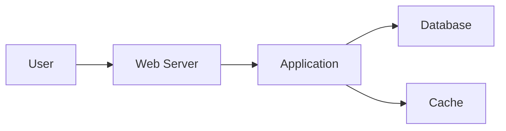

# GitLab CE Refresh: Ежегодный/Полугодовой курс для DevOps

**Цель:** Освежить в памяти ключевые концепции GitLab CE за 2-3 часа практики и узнать 1-2 новые продвинутые техники.

**Формат:** Каждый раздел состоит из:
1. **Краткой теории (Напоминалка)**: Самое главное, что вы могли забыть
2. **Практического задания**: Реальная задача, которую нужно решить
3. **Бонусного задания (для роста)**: Задача посложнее или с использованием новой фичи

**Предварительные требования:**
- Доступ к GitLab CE (локальный или облачный)
- Git установлен и настроен
- Базовые знания Git
- Docker установлен (для CI/CD)

---

## Модуль 1: Основы GitLab и Git Workflow (20 минут)

### 🎯 Напоминалка

**Архитектура GitLab CE:**
```
GitLab Instance:
├── Projects           # Репозитории
├── Groups            # Группы проектов
├── Users             # Пользователи
├── CI/CD             # Runners и pipelines
├── Container Registry # Docker registry
├── Package Registry  # Maven, npm, etc.
└── Wiki              # Документация
```

**Основные команды Git:**
```bash
# Конфигурация
git config --global user.name "Your Name"
git config --global user.email "your.email@example.com"
git config --list

# Клонирование и инициализация
git clone <url>
git init

# Основные операции
git status
git add <file>
git add .
git commit -m "message"
git commit -am "message"  # add + commit для tracked files

# Работа с ветками
git branch                # Список веток
git branch <name>         # Создать ветку
git checkout <branch>     # Переключиться
git checkout -b <branch>  # Создать и переключиться
git switch <branch>       # Новый способ (Git 2.23+)
git switch -c <branch>    # Создать и переключиться

# Удаление веток
git branch -d <branch>    # Локально
git push origin --delete <branch>  # Remote

# Слияние
git merge <branch>
git merge --no-ff <branch>  # С merge commit
git merge --squash <branch> # Объединить все коммиты

# Rebase
git rebase <branch>
git rebase -i HEAD~3      # Интерактивный для последних 3 коммитов

# Синхронизация
git fetch                 # Получить изменения
git pull                  # Fetch + merge
git pull --rebase         # Fetch + rebase
git push
git push -u origin <branch>  # Установить upstream
git push --force-with-lease  # Безопасный force push

# История
git log
git log --oneline
git log --graph --oneline --all
git log --author="Name"
git log --since="2 weeks ago"

# Отмена изменений
git reset HEAD <file>     # Unstage
git checkout -- <file>    # Отменить изменения
git revert <commit>       # Создать коммит отмены
git reset --soft HEAD~1   # Отменить коммит, оставить изменения
git reset --hard HEAD~1   # Отменить коммит и изменения

# Stash
git stash                 # Спрятать изменения
git stash list
git stash pop
git stash apply
git stash drop

# Работа с remote
git remote -v
git remote add <name> <url>
git remote remove <name>
```

**GitLab Workflow:**
```
1. Создать Issue
2. Создать ветку из Issue
3. Сделать изменения и коммиты
4. Создать Merge Request (MR)
5. Code Review
6. CI/CD Pipeline
7. Merge в main
8. Deploy
```

**Модель ветвления (Git Flow):**
```
main (production)
  ├── develop (integration)
  │   ├── feature/feature-name
  │   ├── feature/another-feature
  │   └── bugfix/bug-name
  ├── release/v1.0.0
  └── hotfix/critical-bug
```

**GitLab CLI (glab):**
```bash
# Установка
# macOS
brew install glab

# Linux
sudo snap install glab

# Настройка
glab auth login

# Основные команды
glab repo clone <project>
glab mr create
glab mr list
glab mr view <id>
glab mr merge <id>
glab issue create
glab issue list
glab ci view
```

### 💻 Задание

Настрой базовое окружение GitLab:

1. **Установи GitLab CE локально** (Docker):
```bash
# Создай директорию для данных
mkdir -p ~/gitlab/{config,logs,data}

# Запусти GitLab CE
docker run -d \
  --hostname gitlab.local \
  --name gitlab \
  -p 80:80 -p 443:443 -p 22:22 \
  --volume ~/gitlab/config:/etc/gitlab \
  --volume ~/gitlab/logs:/var/log/gitlab \
  --volume ~/gitlab/data:/var/opt/gitlab \
  gitlab/gitlab-ce:latest

# Дождись запуска (5-10 минут)
docker logs -f gitlab
```

2. **Получи root пароль:**
```bash
docker exec -it gitlab grep 'Password:' /etc/gitlab/initial_root_password
```

3. **Открой GitLab:** http://localhost
   - Login: root
   - Password: из предыдущего шага

4. **Создай первый проект:**
   - Имя: "test-app"
   - Visibility: Private
   - Initialize with README: да

5. **Клонируй проект:**
```bash
git clone http://localhost/root/test-app.git
cd test-app
```

6. **Создай базовую структуру:**
```bash
# Создай файлы
echo "# Test Application" > README.md
mkdir src
echo "print('Hello GitLab')" > src/app.py

# Коммит
git add .
git commit -m "Initial project structure"
git push origin main
```

7. **Создай feature ветку:**
```bash
git checkout -b feature/add-tests
echo "def test_app(): pass" > src/test_app.py
git add .
git commit -m "Add basic test file"
git push -u origin feature/add-tests
```

8. **Создай Merge Request через UI:**
   - Source: feature/add-tests
   - Target: main
   - Title: "Add test file"
   - Описание: "Added basic test structure"

### 🚀 Бонус (новое)

**1. Настрой SSH ключи для GitLab:**
```bash
# Генерация ключа
ssh-keygen -t ed25519 -C "your.email@example.com"

# Добавь публичный ключ в GitLab
cat ~/.ssh/id_ed25519.pub
# Settings → SSH Keys → Add key

# Тест соединения
ssh -T git@localhost

# Используй SSH URL
git remote set-url origin git@localhost:root/test-app.git
```

**2. Настрой Git алиасы:**
```bash
git config --global alias.co checkout
git config --global alias.br branch
git config --global alias.ci commit
git config --global alias.st status
git config --global alias.lg "log --graph --oneline --all --decorate"
git config --global alias.last "log -1 HEAD"
git config --global alias.unstage "reset HEAD --"
```

**3. Используй .gitconfig для продвинутой настройки:**
```bash
cat >> ~/.gitconfig << 'EOF'
[core]
    editor = vim
    autocrlf = input
[pull]
    rebase = true
[push]
    default = current
    followTags = true
[diff]
    tool = vimdiff
[merge]
    tool = vimdiff
    conflictstyle = diff3
[alias]
    st = status -sb
    co = checkout
    br = branch
    ci = commit
    cp = cherry-pick
    lg = log --graph --pretty=format:'%Cred%h%Creset -%C(yellow)%d%Creset %s %Cgreen(%cr) %C(bold blue)<%an>%Creset' --abbrev-commit --date=relative
    contributors = shortlog --summary --numbered --email
    amend = commit --amend --no-edit
    undo = reset --soft HEAD^
    unstage = reset HEAD --
EOF
```

---

## Модуль 2: Issues и Project Management (25 минут)

### 🎯 Напоминалка

**Issues - основа управления проектом:**
```yaml
Issue структура:
  - Title
  - Description (Markdown)
  - Labels
  - Milestone
  - Assignee
  - Due date
  - Weight (EE)
  - Epic (EE)
```

**Labels (метки):**
```
bug           # Ошибка
feature       # Новая функция
enhancement   # Улучшение
documentation # Документация
priority::high # Высокий приоритет
status::wip   # Work in Progress
```

**Board типы:**
```
Issue Board:
├── Open
├── In Progress
├── Review
└── Done

Scoped labels:
  status::open
  status::in-progress
  status::review
  status::done
```

**Milestones:**
```
Sprint 1 (v1.0.0)
├── Issue #1
├── Issue #2
└── Issue #3
```

**Quick Actions (в комментариях):**
```
/assign @username     # Назначить
/label ~bug          # Добавить label
/milestone %sprint1  # Добавить в milestone
/due 2024-12-31      # Установить deadline
/estimate 2h         # Оценка времени
/spend 1h            # Затраченное время
/close               # Закрыть issue
/reopen              # Открыть снова
/weight 3            # Вес задачи (1-9)
```

**Issue Templates:**
```markdown
# .gitlab/issue_templates/Bug.md
## Bug Description


## Steps to Reproduce
1. 
2. 
3. 

## Expected Behavior


## Actual Behavior


## Environment
- OS:
- Browser:
- Version:

## Screenshots


/label ~bug
```

**Связь Issues с MR:**
```markdown
# В описании MR
Closes #123
Fixes #456
Resolves #789
Related to #101

# В коммите
git commit -m "Fix login bug

Closes #123"
```

### 💻 Задание

Настрой систему управления проектом:

1. **Создай Labels:**
   - Settings → Labels
   - Создай: bug, feature, enhancement, documentation
   - Создай scoped: priority::high, priority::medium, priority::low
   - Создай scoped: status::todo, status::doing, status::done

2. **Создай Issue Templates:**
```bash
cd test-app
mkdir -p .gitlab/issue_templates

cat > .gitlab/issue_templates/Bug.md << 'EOF'
## Bug Description


## Steps to Reproduce
1. 
2. 

## Expected Behavior


## Actual Behavior


## Environment


/label ~bug ~priority::high
EOF

cat > .gitlab/issue_templates/Feature.md << 'EOF'
## Feature Description


## User Story
As a [user type]
I want [goal]
So that [benefit]

## Acceptance Criteria
- [ ] 
- [ ] 

## Additional Context


/label ~feature
EOF

git add .gitlab/
git commit -m "Add issue templates"
git push
```

3. **Создай Milestone:**
   - Issues → Milestones → New milestone
   - Title: "v1.0.0"
   - Start date: сегодня
   - Due date: через 2 недели

4. **Создай несколько Issues:**
   - Issue #1: "Add user authentication" (feature, v1.0.0)
   - Issue #2: "Fix homepage layout" (bug, priority::high)
   - Issue #3: "Update documentation" (documentation)

5. **Создай Issue Board:**
   - Issues → Boards → New board
   - Columns: Open → In Progress → Review → Closed
   - Используй scoped labels для автоматизации

6. **Создай ветку из Issue:**
   - Открой Issue #1
   - Create merge request → Create branch
   - Имя ветки: автоматически (1-add-user-authentication)

### 🚀 Бонус (новое)

**1. Создай автоматизацию с Quick Actions:**
```bash
# Создай новый issue через API
curl --request POST \
  --header "PRIVATE-TOKEN: your-token" \
  --data "title=Automated Issue&description=/assign @username%0A/label ~feature%0A/milestone %v1.0.0" \
  "http://localhost/api/v4/projects/1/issues"
```

**2. Используй Issue Weight для оценки:**
```markdown
# В issue добавь
/weight 5

# Это позволит видеть прогресс в milestone
```

**3. Создай связанные Issues:**
```markdown
# В описании issue
Related to #2
Blocks #3
Blocked by #1
```

**4. Настрой Issue Board с WIP limits:**
   - Создай board
   - Edit board → Set WIP limit для каждой колонки
   - In Progress: max 3 issues

---

## Модуль 3: Merge Requests и Code Review (30 минут)

### 🎯 Напоминалка

**Merge Request (MR) структура:**
```yaml
MR содержит:
  - Title
  - Description
  - Source branch
  - Target branch
  - Assignee (reviewer)
  - Reviewer
  - Labels
  - Milestone
  - Related Issues
  - Approval rules
  - Pipeline status
```

**MR Description Template:**
```markdown
## What does this MR do?


## Related Issues
Closes #

## Checklist
- [ ] Tests added/updated
- [ ] Documentation updated
- [ ] Changelog updated
- [ ] Code follows style guide

## Screenshots (if applicable)


## Testing Instructions
1. 
2. 
```

**Code Review процесс:**
```
1. Create MR
2. Assign reviewers
3. CI/CD Pipeline runs
4. Code Review
   ├── General comments
   ├── Line comments
   ├── Suggestions
   └── Discussions
5. Make changes
6. Re-review
7. Approve
8. Merge
```

**Merge стратегии:**
```bash
# Merge commit (по умолчанию)
git merge --no-ff feature-branch

# Squash and merge (все коммиты в один)
git merge --squash feature-branch

# Rebase and merge (линейная история)
git rebase main
git checkout main
git merge feature-branch --ff-only

# Fast-forward (без merge commit)
git merge --ff-only feature-branch
```

**Approval Rules:**
```yaml
Rules:
  - Minimum approvals: 2
  - Approval from code owners
  - Approval from eligible users
  - Remove all approvals on push
```

**Draft MR:**
```markdown
# Создать Draft MR
Title: Draft: Add feature X

# Или в UI
☑ Mark as draft

# Когда готово к review
/ready
```

**Quick Actions в MR:**
```
/approve           # Одобрить
/unapprove        # Отменить одобрение
/assign @user     # Назначить
/unassign @user   # Снять назначение
/merge            # Слить MR
/draft            # Пометить как черновик
/ready            # Убрать черновик
/wip              # Work in Progress (старое)
/target_branch main # Сменить target ветку
```

**Suggestions в Code Review:**
```markdown
# Оставь комментарий с suggestion
```suggestion
def improved_function():
    return "Better implementation"
```

# Автор может применить одним кликом
```

### 💻 Задание

Настрой процесс Code Review:

1. **Создай MR Template:**
```bash
cd test-app
mkdir -p .gitlab/merge_request_templates

cat > .gitlab/merge_request_templates/Default.md << 'EOF'
## What does this MR do?


## Related Issues
Closes #

## Changes
- 
- 

## Checklist
- [ ] Code follows style guide
- [ ] Tests added/updated
- [ ] Documentation updated
- [ ] No breaking changes
- [ ] Changelog updated

## Testing
<!-- Describe how to test these changes -->

## Screenshots
<!-- If applicable -->

/assign @reviewer
EOF

git add .gitlab/
git commit -m "Add MR template"
git push
```

2. **Создай feature branch и сделай изменения:**
```bash
git checkout -b feature/user-login

cat > src/auth.py << 'EOF'
def login(username, password):
    """Authenticate user"""
    if not username or not password:
        return False
    # TODO: Add real authentication
    return True

def logout(session_id):
    """Logout user"""
    # TODO: Implement logout
    pass
EOF

git add src/auth.py
git commit -m "Add authentication module"
git push -u origin feature/user-login
```

3. **Создай Merge Request через UI:**
   - Title: "Add user authentication module"
   - Description: используй template
   - Target: main
   - Связь: Closes #1
   - Assignee: yourself

4. **Сделай Code Review:**
   - Открой созданный MR
   - Оставь несколько комментариев к коду
   - Используй Suggestions:
```python
# Suggestion для улучшения
```suggestion
def login(username: str, password: str) -> bool:
    """
    Authenticate user with username and password.
    
    Args:
        username: User's username
        password: User's password
        
    Returns:
        True if authentication successful, False otherwise
    """
    if not username or not password:
        return False
    # TODO: Add real authentication logic
    return True
```

5. **Примени Suggestions и обнови MR:**
```bash
# GitLab автоматически создаст коммит при применении suggestion
# Или сделай изменения вручную
git checkout feature/user-login
# внеси изменения
git add src/auth.py
git commit -m "Apply code review suggestions"
git push
```

6. **Настрой Approval Rules:**
   - Settings → General → Merge request approvals
   - Minimum approvals: 1
   - ✓ Remove all approvals when commits are added

7. **Approve и Merge:**
   - Approve MR
   - Merge when pipeline succeeds
   - ✓ Delete source branch

### 🚀 Бонус (новое)

**1. Настрой Protected Branches:**
```yaml
# Settings → Repository → Protected branches
main:
  Allowed to merge: Maintainers
  Allowed to push: No one
  Allowed to force push: No
  Code owner approval: Yes
```

**2. Создай CODEOWNERS файл:**
```bash
cat > .gitlab/CODEOWNERS << 'EOF'
# Default owners
* @team-lead

# Backend
/src/*.py @backend-team

# Frontend
/frontend/ @frontend-team

# DevOps
/.gitlab-ci.yml @devops-team
/Dockerfile @devops-team

# Documentation
/docs/ @tech-writers
*.md @tech-writers
EOF

git add .gitlab/CODEOWNERS
git commit -m "Add CODEOWNERS"
git push
```

**3. Используй Multiple Reviewers:**
   - В MR добавь несколько Reviewers
   - Настрой правило: "Approval from 2 of 3 reviewers"

**4. Настрой Merge Checks:**
```yaml
# Settings → General → Merge requests
Merge checks:
  ✓ Pipeline must succeed
  ✓ All threads must be resolved
  ✓ All approvals must be given
  ✓ Status checks must pass
```

**5. Используй Review Apps (будет настроено в CI/CD модуле)**

---

## Модуль 4: GitLab CI/CD Basics (35 минут)

### 🎯 Напоминалка

**GitLab CI/CD архитектура:**
```
.gitlab-ci.yml → GitLab → Runner → Executor → Container/Shell
```

**Базовый .gitlab-ci.yml:**
```yaml
stages:
  - build
  - test
  - deploy

build-job:
  stage: build
  script:
    - echo "Building..."
    - make build

test-job:
  stage: test
  script:
    - echo "Testing..."
    - make test

deploy-job:
  stage: deploy
  script:
    - echo "Deploying..."
    - make deploy
  only:
    - main
```

**Stages и Jobs:**
```yaml
stages:          # Порядок выполнения
  - build
  - test
  - deploy

job1:           # Job в стадии
  stage: build
  script:       # Команды для выполнения
    - echo "Hello"
```

**Runners:**
```bash
# Типы runners:
- Shared runners    # Доступны всем проектам
- Group runners     # Для группы проектов
- Specific runners  # Для конкретного проекта

# Executors:
- Docker           # Наиболее популярный
- Shell            # Прямо на хосте
- Kubernetes       # В K8s
- Docker Machine   # Автомасштабирование
```

**Variables:**
```yaml
variables:
  GLOBAL_VAR: "value"

job:
  variables:
    JOB_VAR: "value"
  script:
    - echo $GLOBAL_VAR
    - echo $JOB_VAR
    - echo $CI_COMMIT_SHA  # Предопределенная
```

**Предопределенные переменные:**
```bash
$CI_PROJECT_NAME     # Имя проекта
$CI_COMMIT_SHA       # SHA коммита
$CI_COMMIT_BRANCH    # Ветка
$CI_PIPELINE_ID      # ID pipeline
$CI_JOB_ID          # ID job
$CI_REGISTRY        # Container registry
$CI_REGISTRY_USER   # Registry пользователь
$CI_REGISTRY_PASSWORD # Registry пароль
```

**Artifacts:**
```yaml
job:
  script:
    - make build
  artifacts:
    paths:
      - build/
      - dist/
    expire_in: 1 week
```

**Cache:**
```yaml
cache:
  key: ${CI_COMMIT_REF_SLUG}
  paths:
    - node_modules/
    - .npm/

job:
  cache:
    key: custom-key
    paths:
      - vendor/
```

**Rules (условия):**
```yaml
job:
  rules:
    - if: '$CI_COMMIT_BRANCH == "main"'
      when: always
    - if: '$CI_COMMIT_BRANCH =~ /^feature/'
      when: manual
    - when: never
```

**Dependencies:**
```yaml
build:
  stage: build
  script: make build
  artifacts:
    paths:
      - build/

test:
  stage: test
  dependencies:
    - build
  script: test build/
```

### 💻 Задание

Настрой CI/CD pipeline:

1. **Зарегистрируй GitLab Runner:**
```bash
# Запусти Runner в Docker
docker run -d --name gitlab-runner --restart always \
  -v /var/run/docker.sock:/var/run/docker.sock \
  -v gitlab-runner-config:/etc/gitlab-runner \
  gitlab/gitlab-runner:latest

# Зарегистрируй runner
docker exec -it gitlab-runner gitlab-runner register \
  --url http://gitlab.local \
  --registration-token "YOUR_TOKEN" \
  --executor docker \
  --docker-image alpine:latest \
  --description "docker-runner" \
  --tag-list "docker,linux" \
  --run-untagged="true" \
  --locked="false"

# Получи токен: Settings → CI/CD → Runners
```

2. **Создай простой .gitlab-ci.yml:**
```bash
cd test-app

cat > .gitlab-ci.yml << 'EOF'
stages:
  - build
  - test
  - deploy

variables:
  PYTHON_VERSION: "3.11"

before_script:
  - echo "Starting pipeline for $CI_COMMIT_BRANCH"

build:
  stage: build
  image: python:${PYTHON_VERSION}-slim
  script:
    - echo "Building application..."
    - pip install -r requirements.txt || echo "No requirements.txt"
    - python -m py_compile src/*.py
  artifacts:
    paths:
      - src/
    expire_in: 1 hour

test:
  stage: test
  image: python:${PYTHON_VERSION}-slim
  dependencies:
    - build
  script:
    - echo "Running tests..."
    - pip install pytest || true
    - pytest src/ || echo "Tests completed"
  coverage: '/TOTAL.*\s+(\d+%)$/'

lint:
  stage: test
  image: python:${PYTHON_VERSION}-slim
  script:
    - echo "Running linter..."
    - pip install flake8 || true
    - flake8 src/ || echo "Linting completed"
  allow_failure: true

deploy-staging:
  stage: deploy
  script:
    - echo "Deploying to staging..."
    - echo "Application deployed!"
  environment:
    name: staging
    url: https://staging.example.com
  only:
    - develop

deploy-production:
  stage: deploy
  script:
    - echo "Deploying to production..."
    - echo "Application deployed!"
  environment:
    name: production
    url: https://example.com
  only:
    - main
  when: manual
EOF

git add .gitlab-ci.yml
git commit -m "Add CI/CD pipeline"
git push
```

3. **Создай requirements.txt:**
```bash
cat > requirements.txt << 'EOF'
pytest==7.4.0
flake8==6.0.0
EOF

git add requirements.txt
git commit -m "Add Python dependencies"
git push
```

4. **Проверь Pipeline:**
   - CI/CD → Pipelines
   - Открой последний pipeline
   - Посмотри логи каждого job
   - Проверь artifacts

5. **Создай переменные окружения:**
   - Settings → CI/CD → Variables
   - Add variable:
     - Key: API_KEY
     - Value: secret-key-123
     - Type: Variable
     - Protected: Yes
     - Masked: Yes

6. **Используй переменные в pipeline:**
```yaml
# Добавь в .gitlab-ci.yml
deploy-production:
  stage: deploy
  script:
    - echo "API Key: $API_KEY"
    - echo "Deploying with credentials..."
```

### 🚀 Бонус (новое)

**1. Используй Docker in Docker:**
```yaml
build-docker:
  stage: build
  image: docker:latest
  services:
    - docker:dind
  variables:
    DOCKER_TLS_CERTDIR: "/certs"
  before_script:
    - docker login -u $CI_REGISTRY_USER -p $CI_REGISTRY_PASSWORD $CI_REGISTRY
  script:
    - docker build -t $CI_REGISTRY_IMAGE:$CI_COMMIT_SHA .
    - docker push $CI_REGISTRY_IMAGE:$CI_COMMIT_SHA
```

**2. Используй Cache для ускорения:**
```yaml
variables:
  PIP_CACHE_DIR: "$CI_PROJECT_DIR/.cache/pip"

cache:
  paths:
    - .cache/pip
    - venv/

test:
  before_script:
    - python -m venv venv
    - source venv/bin/activate
    - pip install -r requirements.txt
```

**3. Параллельное выполнение тестов:**
```yaml
test:
  stage: test
  parallel: 3
  script:
    - pytest --splits 3 --group $CI_NODE_INDEX
```

**4. Используй includes для модульности:**
```yaml
# .gitlab-ci.yml
include:
  - local: '.gitlab/ci/build.yml'
  - local: '.gitlab/ci/test.yml'
  - local: '.gitlab/ci/deploy.yml'

# .gitlab/ci/build.yml
build:
  stage: build
  script:
    - make build
```

---

## Модуль 5: Advanced CI/CD (40 минут)

### 🎯 Напоминалка

**Multi-stage Builds:**
```yaml
stages:
  - build
  - test
  - security
  - deploy
  - cleanup
```

**Environments:**
```yaml
deploy-staging:
  environment:
    name: staging/$CI_COMMIT_REF_NAME
    url: https://$CI_COMMIT_REF_SLUG.staging.example.com
    on_stop: stop-staging
    auto_stop_in: 1 day

stop-staging:
  environment:
    name: staging/$CI_COMMIT_REF_NAME
    action: stop
  when: manual
```

**Conditional Jobs:**
```yaml
job:
  rules:
    - if: '$CI_PIPELINE_SOURCE == "merge_request_event"'
    - if: '$CI_COMMIT_BRANCH == "main"'
    - if: '$CI_COMMIT_TAG'
    - changes:
        - src/**/*
      when: always
    - when: never
```

**Needs (DAG):**
```yaml
build:
  stage: build
  script: make build

test:unit:
  stage: test
  needs: [build]
  script: make test-unit

test:integration:
  stage: test
  needs: [build]
  script: make test-integration

deploy:
  stage: deploy
  needs: [test:unit, test:integration]
  script: make deploy
```

**Child Pipelines:**
```yaml
trigger-child:
  trigger:
    include: child-pipeline.yml
    strategy: depend
```

**Matrix Jobs:**
```yaml
test:
  parallel:
    matrix:
      - PYTHON_VERSION: ["3.9", "3.10", "3.11"]
        OS: ["alpine", "ubuntu"]
  image: python:${PYTHON_VERSION}-${OS}
  script:
    - python --version
    - pytest
```

**Retry:**
```yaml
test:
  script: make test
  retry:
    max: 2
    when:
      - runner_system_failure
      - stuck_or_timeout_failure
```

**Services (Docker Compose style):**
```yaml
test:
  services:
    - postgres:14
    - redis:latest
  variables:
    POSTGRES_DB: test
    POSTGRES_PASSWORD: secret
  script:
    - make test
```

### 💻 Задание

Создай продвинутый CI/CD pipeline:

1. **Создай multi-environment pipeline:**
```bash
cd test-app

cat > .gitlab-ci.yml << 'EOF'
stages:
  - build
  - test
  - security
  - deploy-staging
  - deploy-production

variables:
  DOCKER_IMAGE: $CI_REGISTRY_IMAGE
  DOCKER_TAG: $CI_COMMIT_SHORT_SHA

# Шаблоны
.deploy-template: &deploy-template
  image: alpine:latest
  before_script:
    - apk add --no-cache curl
  script:
    - echo "Deploying to $ENVIRONMENT..."
    - curl -X POST "$DEPLOY_WEBHOOK_URL"

# Build
build:
  stage: build
  image: docker:latest
  services:
    - docker:dind
  before_script:
    - docker login -u $CI_REGISTRY_USER -p $CI_REGISTRY_PASSWORD $CI_REGISTRY
  script:
    - docker build -t $DOCKER_IMAGE:$DOCKER_TAG .
    - docker tag $DOCKER_IMAGE:$DOCKER_TAG $DOCKER_IMAGE:latest
    - docker push $DOCKER_IMAGE:$DOCKER_TAG
    - docker push $DOCKER_IMAGE:latest
  only:
    - main
    - develop

# Тесты параллельно
test:unit:
  stage: test
  image: python:3.11-slim
  needs: [build]
  script:
    - pip install pytest pytest-cov
    - pytest tests/unit/ --cov=src --cov-report=xml
  coverage: '/TOTAL.*\s+(\d+%)$/'
  artifacts:
    reports:
      coverage_report:
        coverage_format: cobertura
        path: coverage.xml
    expire_in: 1 week

test:integration:
  stage: test
  image: python:3.11-slim
  needs: [build]
  services:
    - postgres:14
    - redis:7
  variables:
    POSTGRES_DB: testdb
    POSTGRES_USER: testuser
    POSTGRES_PASSWORD: testpass
    REDIS_HOST: redis
  script:
    - pip install -r requirements.txt
    - pytest tests/integration/
  artifacts:
    when: always
    reports:
      junit: test-results.xml

# Security scanning
security:sast:
  stage: security
  image: python:3.11-slim
  script:
    - pip install bandit
    - bandit -r src/ -f json -o bandit-report.json
  artifacts:
    reports:
      sast: bandit-report.json
  allow_failure: true

security:dependency-check:
  stage: security
  image: python:3.11-slim
  script:
    - pip install safety
    - safety check --json > safety-report.json
  artifacts:
    reports:
      dependency_scanning: safety-report.json
  allow_failure: true

# Staging deployment
deploy:staging:
  <<: *deploy-template
  stage: deploy-staging
  variables:
    ENVIRONMENT: staging
  environment:
    name: staging
    url: https://staging.example.com
    on_stop: stop:staging
    auto_stop_in: 1 day
  only:
    - develop

stop:staging:
  <<: *deploy-template
  stage: deploy-staging
  variables:
    ENVIRONMENT: staging
  script:
    - echo "Stopping staging environment..."
  environment:
    name: staging
    action: stop
  when: manual
  only:
    - develop

# Production deployment
deploy:production:
  <<: *deploy-template
  stage: deploy-production
  variables:
    ENVIRONMENT: production
  environment:
    name: production
    url: https://example.com
  only:
    - main
  when: manual
  needs:
    - build
    - test:unit
    - test:integration
    - security:sast
EOF

git add .gitlab-ci.yml
git commit -m "Add advanced CI/CD pipeline"
git push
```

2. **Создай Dockerfile для приложения:**
```bash
cat > Dockerfile << 'EOF'
FROM python:3.11-slim

WORKDIR /app

COPY requirements.txt .
RUN pip install --no-cache-dir -r requirements.txt

COPY src/ ./src/

EXPOSE 8000

CMD ["python", "-m", "src.app"]
EOF

git add Dockerfile
git commit -m "Add Dockerfile"
git push
```

3. **Создай тесты:**
```bash
mkdir -p tests/{unit,integration}

cat > tests/unit/test_auth.py << 'EOF'
import pytest
from src.auth import login, logout

def test_login_success():
    assert login("user", "pass") == True

def test_login_empty_credentials():
    assert login("", "") == False

def test_logout():
    assert logout("session123") is not None
EOF

cat > tests/integration/test_api.py << 'EOF'
import pytest

def test_api_health():
    # Integration test placeholder
    assert True
EOF

git add tests/
git commit -m "Add test suites"
git push
```

4. **Создай Review Apps:**
```yaml
# Добавь в .gitlab-ci.yml
review:
  stage: deploy-staging
  script:
    - echo "Deploying review app..."
    - echo "Branch: $CI_COMMIT_REF_NAME"
  environment:
    name: review/$CI_COMMIT_REF_NAME
    url: https://$CI_COMMIT_REF_SLUG.review.example.com
    on_stop: stop-review
    auto_stop_in: 3 days
  only:
    - merge_requests

stop-review:
  stage: deploy-staging
  script:
    - echo "Stopping review app..."
  environment:
    name: review/$CI_COMMIT_REF_NAME
    action: stop
  when: manual
  only:
    - merge_requests
```

5. **Добавь Matrix testing:**
```yaml
# Добавь в .gitlab-ci.yml
test:matrix:
  stage: test
  parallel:
    matrix:
      - PYTHON_VERSION: ["3.9", "3.10", "3.11"]
  image: python:${PYTHON_VERSION}-slim
  script:
    - python --version
    - pip install pytest
    - pytest tests/unit/
```

### 🚀 Бонус (новое)

**1. Используй Child Pipelines для монорепозитория:**
```yaml
# .gitlab-ci.yml
trigger-backend:
  trigger:
    include: backend/.gitlab-ci.yml
    strategy: depend
  only:
    changes:
      - backend/**/*

trigger-frontend:
  trigger:
    include: frontend/.gitlab-ci.yml
    strategy: depend
  only:
    changes:
      - frontend/**/*
```

**2. Динамические Child Pipelines:**
```yaml
generate-pipeline:
  stage: build
  script:
    - python scripts/generate-pipeline.py > generated-pipeline.yml
  artifacts:
    paths:
      - generated-pipeline.yml

trigger-dynamic:
  stage: deploy
  trigger:
    include:
      - artifact: generated-pipeline.yml
        job: generate-pipeline
    strategy: depend
```

**3. Используй GitLab API в pipeline:**
```yaml
create-release:
  stage: deploy
  script:
    - |
      curl --request POST \
        --header "PRIVATE-TOKEN: $CI_JOB_TOKEN" \
        --data tag_name="v$CI_PIPELINE_IID" \
        --data description="Release v$CI_PIPELINE_IID" \
        "$CI_API_V4_URL/projects/$CI_PROJECT_ID/releases"
```

**4. Canary Deployments:**
```yaml
deploy:canary:
  stage: deploy-production
  script:
    - kubectl set image deployment/app app=$DOCKER_IMAGE:$DOCKER_TAG
    - kubectl scale deployment/app-canary --replicas=1
  environment:
    name: production/canary
  when: manual

deploy:production:full:
  stage: deploy-production
  script:
    - kubectl set image deployment/app app=$DOCKER_IMAGE:$DOCKER_TAG
    - kubectl scale deployment/app --replicas=10
  environment:
    name: production
  when: manual
  needs: [deploy:canary]
```

---

## Модуль 6: Container Registry и Package Management (25 минут)

### 🎯 Напоминалка

**Container Registry:**
```bash
# URL format
registry.gitlab.com/username/project

# Login
docker login registry.gitlab.com -u username -p token

# Push
docker tag myapp:latest registry.gitlab.com/username/project:latest
docker push registry.gitlab.com/username/project:latest

# Pull
docker pull registry.gitlab.com/username/project:latest
```

**Package Registry типы:**
```
- Maven (Java)
- npm (JavaScript)
- PyPI (Python)
- NuGet (.NET)
- Composer (PHP)
- Conan (C++)
- Generic packages
```

**Cleanup Policies:**
```yaml
Container Registry cleanup:
  - Keep n tags
  - Keep tags matching regex
  - Remove tags older than X days
  - Remove untagged manifests
```

### 💻 Задание

Настрой Container Registry:

1. **Включи Container Registry:**
   - Settings → General → Visibility → Container Registry: Enabled

2. **Создай Dockerfile если еще нет:**
```bash
cat > Dockerfile << 'EOF'
FROM python:3.11-slim

WORKDIR /app

COPY requirements.txt .
RUN pip install --no-cache-dir -r requirements.txt

COPY src/ ./src/

EXPOSE 8000

HEALTHCHECK --interval=30s --timeout=3s \
  CMD python -c "import urllib.request; urllib.request.urlopen('http://localhost:8000/health')"

CMD ["python", "-m", "src.app"]
EOF

git add Dockerfile
git commit -m "Update Dockerfile with healthcheck"
git push
```

3. **Создай .dockerignore:**
```bash
cat > .dockerignore << 'EOF'
.git
.gitlab-ci.yml
tests/
*.pyc
__pycache__/
.pytest_cache/
*.md
.gitignore
Dockerfile
docker-compose.yml
EOF

git add .dockerignore
git commit -m "Add dockerignore"
git push
```

4. **Обнови CI/CD для push в registry:**
```yaml
# Обнови в .gitlab-ci.yml
build:
  stage: build
  image: docker:latest
  services:
    - docker:dind
  variables:
    DOCKER_TLS_CERTDIR: "/certs"
  before_script:
    - docker login -u $CI_REGISTRY_USER -p $CI_REGISTRY_PASSWORD $CI_REGISTRY
  script:
    - docker build 
        --build-arg VERSION=$CI_COMMIT_SHORT_SHA 
        --cache-from $CI_REGISTRY_IMAGE:latest 
        -t $CI_REGISTRY_IMAGE:$CI_COMMIT_SHORT_SHA 
        -t $CI_REGISTRY_IMAGE:latest 
        .
    - docker push $CI_REGISTRY_IMAGE:$CI_COMMIT_SHORT_SHA
    - docker push $CI_REGISTRY_IMAGE:latest
  only:
    - main
    - develop
    - tags
```

5. **Создай multi-stage build:**
```bash
cat > Dockerfile.multistage << 'EOF'
# Build stage
FROM python:3.11-slim AS builder

WORKDIR /app

RUN apt-get update && \
    apt-get install -y --no-install-recommends gcc && \
    rm -rf /var/lib/apt/lists/*

COPY requirements.txt .
RUN pip wheel --no-cache-dir --no-deps --wheel-dir /app/wheels -r requirements.txt

# Runtime stage
FROM python:3.11-slim

WORKDIR /app

COPY --from=builder /app/wheels /wheels
COPY --from=builder /app/requirements.txt .

RUN pip install --no-cache /wheels/*

COPY src/ ./src/

RUN useradd -m -u 1000 appuser && chown -R appuser:appuser /app
USER appuser

EXPOSE 8000

HEALTHCHECK --interval=30s --timeout=3s --start-period=5s --retries=3 \
  CMD python -c "import http.client; conn = http.client.HTTPConnection('localhost:8000'); conn.request('GET', '/health'); r = conn.getresponse(); exit(0 if r.status == 200 else 1)"

CMD ["python", "-m", "src.app"]
EOF

git add Dockerfile.multistage
git commit -m "Add multi-stage Dockerfile"
git push
```

6. **Настрой cleanup policy:**
   - Settings → Packages & Registries → Container Registry
   - Enable cleanup policy:
     - Keep most recent: 10 tags
     - Keep tags matching: `^v\d+\.\d+\.\d+# GitLab CE Refresh: Ежегодный/Полугодовой курс для DevOps

**Цель:** Освежить в памяти ключевые концепции GitLab CE за 2-3 часа практики и узнать 1-2 новые продвинутые техники.

**Формат:** Каждый раздел состоит из:
1. **Краткой теории (Напоминалка)**: Самое главное, что вы могли забыть
2. **Практического задания**: Реальная задача, которую нужно решить
3. **Бонусного задания (для роста)**: Задача посложнее или с использованием новой фичи

**Предварительные требования:**
- Доступ к GitLab CE (локальный или облачный)
- Git установлен и настроен
- Базовые знания Git
- Docker установлен (для CI/CD)

---

## Модуль 1: Основы GitLab и Git Workflow (20 минут)

### 🎯 Напоминалка

**Архитектура GitLab CE:**
```
GitLab Instance:
├── Projects           # Репозитории
├── Groups            # Группы проектов
├── Users             # Пользователи
├── CI/CD             # Runners и pipelines
├── Container Registry # Docker registry
├── Package Registry  # Maven, npm, etc.
└── Wiki              # Документация
```

**Основные команды Git:**
```bash
# Конфигурация
git config --global user.name "Your Name"
git config --global user.email "your.email@example.com"
git config --list

# Клонирование и инициализация
git clone <url>
git init

# Основные операции
git status
git add <file>
git add .
git commit -m "message"
git commit -am "message"  # add + commit для tracked files

# Работа с ветками
git branch                # Список веток
git branch <name>         # Создать ветку
git checkout <branch>     # Переключиться
git checkout -b <branch>  # Создать и переключиться
git switch <branch>       # Новый способ (Git 2.23+)
git switch -c <branch>    # Создать и переключиться

# Удаление веток
git branch -d <branch>    # Локально
git push origin --delete <branch>  # Remote

# Слияние
git merge <branch>
git merge --no-ff <branch>  # С merge commit
git merge --squash <branch> # Объединить все коммиты

# Rebase
git rebase <branch>
git rebase -i HEAD~3      # Интерактивный для последних 3 коммитов

# Синхронизация
git fetch                 # Получить изменения
git pull                  # Fetch + merge
git pull --rebase         # Fetch + rebase
git push
git push -u origin <branch>  # Установить upstream
git push --force-with-lease  # Безопасный force push

# История
git log
git log --oneline
git log --graph --oneline --all
git log --author="Name"
git log --since="2 weeks ago"

# Отмена изменений
git reset HEAD <file>     # Unstage
git checkout -- <file>    # Отменить изменения
git revert <commit>       # Создать коммит отмены
git reset --soft HEAD~1   # Отменить коммит, оставить изменения
git reset --hard HEAD~1   # Отменить коммит и изменения

# Stash
git stash                 # Спрятать изменения
git stash list
git stash pop
git stash apply
git stash drop

# Работа с remote
git remote -v
git remote add <name> <url>
git remote remove <name>
```

**GitLab Workflow:**
```
1. Создать Issue
2. Создать ветку из Issue
3. Сделать изменения и коммиты
4. Создать Merge Request (MR)
5. Code Review
6. CI/CD Pipeline
7. Merge в main
8. Deploy
```

**Модель ветвления (Git Flow):**
```
main (production)
  ├── develop (integration)
  │   ├── feature/feature-name
  │   ├── feature/another-feature
  │   └── bugfix/bug-name
  ├── release/v1.0.0
  └── hotfix/critical-bug
```

**GitLab CLI (glab):**
```bash
# Установка
# macOS
brew install glab

# Linux
sudo snap install glab

# Настройка
glab auth login

# Основные команды
glab repo clone <project>
glab mr create
glab mr list
glab mr view <id>
glab mr merge <id>
glab issue create
glab issue list
glab ci view
```

### 💻 Задание

Настрой базовое окружение GitLab:

1. **Установи GitLab CE локально** (Docker):
```bash
# Создай директорию для данных
mkdir -p ~/gitlab/{config,logs,data}

# Запусти GitLab CE
docker run -d \
  --hostname gitlab.local \
  --name gitlab \
  -p 80:80 -p 443:443 -p 22:22 \
  --volume ~/gitlab/config:/etc/gitlab \
  --volume ~/gitlab/logs:/var/log/gitlab \
  --volume ~/gitlab/data:/var/opt/gitlab \
  gitlab/gitlab-ce:latest

# Дождись запуска (5-10 минут)
docker logs -f gitlab
```

2. **Получи root пароль:**
```bash
docker exec -it gitlab grep 'Password:' /etc/gitlab/initial_root_password
```

3. **Открой GitLab:** http://localhost
   - Login: root
   - Password: из предыдущего шага

4. **Создай первый проект:**
   - Имя: "test-app"
   - Visibility: Private
   - Initialize with README: да

5. **Клонируй проект:**
```bash
git clone http://localhost/root/test-app.git
cd test-app
```

6. **Создай базовую структуру:**
```bash
# Создай файлы
echo "# Test Application" > README.md
mkdir src
echo "print('Hello GitLab')" > src/app.py

# Коммит
git add .
git commit -m "Initial project structure"
git push origin main
```

7. **Создай feature ветку:**
```bash
git checkout -b feature/add-tests
echo "def test_app(): pass" > src/test_app.py
git add .
git commit -m "Add basic test file"
git push -u origin feature/add-tests
```

8. **Создай Merge Request через UI:**
   - Source: feature/add-tests
   - Target: main
   - Title: "Add test file"
   - Описание: "Added basic test structure"

### 🚀 Бонус (новое)

**1. Настрой SSH ключи для GitLab:**
```bash
# Генерация ключа
ssh-keygen -t ed25519 -C "your.email@example.com"

# Добавь публичный ключ в GitLab
cat ~/.ssh/id_ed25519.pub
# Settings → SSH Keys → Add key

# Тест соединения
ssh -T git@localhost

# Используй SSH URL
git remote set-url origin git@localhost:root/test-app.git
```

**2. Настрой Git алиасы:**
```bash
git config --global alias.co checkout
git config --global alias.br branch
git config --global alias.ci commit
git config --global alias.st status
git config --global alias.lg "log --graph --oneline --all --decorate"
git config --global alias.last "log -1 HEAD"
git config --global alias.unstage "reset HEAD --"
```

**3. Используй .gitconfig для продвинутой настройки:**
```bash
cat >> ~/.gitconfig << 'EOF'
[core]
    editor = vim
    autocrlf = input
[pull]
    rebase = true
[push]
    default = current
    followTags = true
[diff]
    tool = vimdiff
[merge]
    tool = vimdiff
    conflictstyle = diff3
[alias]
    st = status -sb
    co = checkout
    br = branch
    ci = commit
    cp = cherry-pick
    lg = log --graph --pretty=format:'%Cred%h%Creset -%C(yellow)%d%Creset %s %Cgreen(%cr) %C(bold blue)<%an>%Creset' --abbrev-commit --date=relative
    contributors = shortlog --summary --numbered --email
    amend = commit --amend --no-edit
    undo = reset --soft HEAD^
    unstage = reset HEAD --
EOF
```

---

## Модуль 2: Issues и Project Management (25 минут)

### 🎯 Напоминалка

**Issues - основа управления проектом:**
```yaml
Issue структура:
  - Title
  - Description (Markdown)
  - Labels
  - Milestone
  - Assignee
  - Due date
  - Weight (EE)
  - Epic (EE)
```

**Labels (метки):**
```
bug           # Ошибка
feature       # Новая функция
enhancement   # Улучшение
documentation # Документация
priority::high # Высокий приоритет
status::wip   # Work in Progress
```

**Board типы:**
```
Issue Board:
├── Open
├── In Progress
├── Review
└── Done

Scoped labels:
  status::open
  status::in-progress
  status::review
  status::done
```

**Milestones:**
```
Sprint 1 (v1.0.0)
├── Issue #1
├── Issue #2
└── Issue #3
```

**Quick Actions (в комментариях):**
```
/assign @username     # Назначить
/label ~bug          # Добавить label
/milestone %sprint1  # Добавить в milestone
/due 2024-12-31      # Установить deadline
/estimate 2h         # Оценка времени
/spend 1h            # Затраченное время
/close               # Закрыть issue
/reopen              # Открыть снова
/weight 3            # Вес задачи (1-9)
```

**Issue Templates:**
```markdown
# .gitlab/issue_templates/Bug.md
## Bug Description


## Steps to Reproduce
1. 
2. 
3. 

## Expected Behavior


## Actual Behavior


## Environment
- OS:
- Browser:
- Version:

## Screenshots


/label ~bug
```

**Связь Issues с MR:**
```markdown
# В описании MR
Closes #123
Fixes #456
Resolves #789
Related to #101

# В коммите
git commit -m "Fix login bug

Closes #123"
```

### 💻 Задание

Настрой систему управления проектом:

1. **Создай Labels:**
   - Settings → Labels
   - Создай: bug, feature, enhancement, documentation
   - Создай scoped: priority::high, priority::medium, priority::low
   - Создай scoped: status::todo, status::doing, status::done

2. **Создай Issue Templates:**
```bash
cd test-app
mkdir -p .gitlab/issue_templates

cat > .gitlab/issue_templates/Bug.md << 'EOF'
## Bug Description


## Steps to Reproduce
1. 
2. 

## Expected Behavior


## Actual Behavior


## Environment


/label ~bug ~priority::high
EOF

cat > .gitlab/issue_templates/Feature.md << 'EOF'
## Feature Description


## User Story
As a [user type]
I want [goal]
So that [benefit]

## Acceptance Criteria
- [ ] 
- [ ] 

## Additional Context


/label ~feature
EOF

git add .gitlab/
git commit -m "Add issue templates"
git push
```

3. **Создай Milestone:**
   - Issues → Milestones → New milestone
   - Title: "v1.0.0"
   - Start date: сегодня
   - Due date: через 2 недели

4. **Создай несколько Issues:**
   - Issue #1: "Add user authentication" (feature, v1.0.0)
   - Issue #2: "Fix homepage layout" (bug, priority::high)
   - Issue #3: "Update documentation" (documentation)

5. **Создай Issue Board:**
   - Issues → Boards → New board
   - Columns: Open → In Progress → Review → Closed
   - Используй scoped labels для автоматизации

6. **Создай ветку из Issue:**
   - Открой Issue #1
   - Create merge request → Create branch
   - Имя ветки: автоматически (1-add-user-authentication)

### 🚀 Бонус (новое)

**1. Создай автоматизацию с Quick Actions:**
```bash
# Создай новый issue через API
curl --request POST \
  --header "PRIVATE-TOKEN: your-token" \
  --data "title=Automated Issue&description=/assign @username%0A/label ~feature%0A/milestone %v1.0.0" \
  "http://localhost/api/v4/projects/1/issues"
```

**2. Используй Issue Weight для оценки:**
```markdown
# В issue добавь
/weight 5

# Это позволит видеть прогресс в milestone
```

**3. Создай связанные Issues:**
```markdown
# В описании issue
Related to #2
Blocks #3
Blocked by #1
```

**4. Настрой Issue Board с WIP limits:**
   - Создай board
   - Edit board → Set WIP limit для каждой колонки
   - In Progress: max 3 issues

---

## Модуль 3: Merge Requests и Code Review (30 минут)

### 🎯 Напоминалка

**Merge Request (MR) структура:**
```yaml
MR содержит:
  - Title
  - Description
  - Source branch
  - Target branch
  - Assignee (reviewer)
  - Reviewer
  - Labels
  - Milestone
  - Related Issues
  - Approval rules
  - Pipeline status
```

**MR Description Template:**
```markdown
## What does this MR do?


## Related Issues
Closes #

## Checklist
- [ ] Tests added/updated
- [ ] Documentation updated
- [ ] Changelog updated
- [ ] Code follows style guide

## Screenshots (if applicable)


## Testing Instructions
1. 
2. 
```

**Code Review процесс:**
```
1. Create MR
2. Assign reviewers
3. CI/CD Pipeline runs
4. Code Review
   ├── General comments
   ├── Line comments
   ├── Suggestions
   └── Discussions
5. Make changes
6. Re-review
7. Approve
8. Merge
```

**Merge стратегии:**
```bash
# Merge commit (по умолчанию)
git merge --no-ff feature-branch

# Squash and merge (все коммиты в один)
git merge --squash feature-branch

# Rebase and merge (линейная история)
git rebase main
git checkout main
git merge feature-branch --ff-only

# Fast-forward (без merge commit)
git merge --ff-only feature-branch
```

**Approval Rules:**
```yaml
Rules:
  - Minimum approvals: 2
  - Approval from code owners
  - Approval from eligible users
  - Remove all approvals on push
```

**Draft MR:**
```markdown
# Создать Draft MR
Title: Draft: Add feature X

# Или в UI
☑ Mark as draft

# Когда готово к review
/ready
```

**Quick Actions в MR:**
```
/approve           # Одобрить
/unapprove        # Отменить одобрение
/assign @user     # Назначить
/unassign @user   # Снять назначение
/merge            # Слить MR
/draft            # Пометить как черновик
/ready            # Убрать черновик
/wip              # Work in Progress (старое)
/target_branch main # Сменить target ветку
```

**Suggestions в Code Review:**
```markdown
# Оставь комментарий с suggestion
```suggestion
def improved_function():
    return "Better implementation"
```

# Автор может применить одним кликом
```

### 💻 Задание

Настрой процесс Code Review:

1. **Создай MR Template:**
```bash
cd test-app
mkdir -p .gitlab/merge_request_templates

cat > .gitlab/merge_request_templates/Default.md << 'EOF'
## What does this MR do?


## Related Issues
Closes #

## Changes
- 
- 

## Checklist
- [ ] Code follows style guide
- [ ] Tests added/updated
- [ ] Documentation updated
- [ ] No breaking changes
- [ ] Changelog updated

## Testing
<!-- Describe how to test these changes -->

## Screenshots
<!-- If applicable -->

/assign @reviewer
EOF

git add .gitlab/
git commit -m "Add MR template"
git push
```

2. **Создай feature branch и сделай изменения:**
```bash
git checkout -b feature/user-login

cat > src/auth.py << 'EOF'
def login(username, password):
    """Authenticate user"""
    if not username or not password:
        return False
    # TODO: Add real authentication
    return True

def logout(session_id):
    """Logout user"""
    # TODO: Implement logout
    pass
EOF

git add src/auth.py
git commit -m "Add authentication module"
git push -u origin feature/user-login
```

3. **Создай Merge Request через UI:**
   - Title: "Add user authentication module"
   - Description: используй template
   - Target: main
   - Связь: Closes #1
   - Assignee: yourself

4. **Сделай Code Review:**
   - Открой созданный MR
   - Оставь несколько комментариев к коду
   - Используй Suggestions:
```python
# Suggestion для улучшения
```suggestion
def login(username: str, password: str) -> bool:
    """
    Authenticate user with username and password.
    
    Args:
        username: User's username
        password: User's password
        
    Returns:
        True if authentication successful, False otherwise
    """
    if not username or not password:
        return False
    # TODO: Add real authentication logic
    return True
```

5. **Примени Suggestions и обнови MR:**
```bash
# GitLab автоматически создаст коммит при применении suggestion
# Или сделай изменения вручную
git checkout feature/user-login
# внеси изменения
git add src/auth.py
git commit -m "Apply code review suggestions"
git push
```

6. **Настрой Approval Rules:**
   - Settings → General → Merge request approvals
   - Minimum approvals: 1
   - ✓ Remove all approvals when commits are added

7. **Approve и Merge:**
   - Approve MR
   - Merge when pipeline succeeds
   - ✓ Delete source branch

### 🚀 Бонус (новое)

**1. Настрой Protected Branches:**
```yaml
# Settings → Repository → Protected branches
main:
  Allowed to merge: Maintainers
  Allowed to push: No one
  Allowed to force push: No
  Code owner approval: Yes
```

**2. Создай CODEOWNERS файл:**
```bash
cat > .gitlab/CODEOWNERS << 'EOF'
# Default owners
* @team-lead

# Backend
/src/*.py @backend-team

# Frontend
/frontend/ @frontend-team

# DevOps
/.gitlab-ci.yml @devops-team
/Dockerfile @devops-team

# Documentation
/docs/ @tech-writers
*.md @tech-writers
EOF

git add .gitlab/CODEOWNERS
git commit -m "Add CODEOWNERS"
git push
```

**3. Используй Multiple Reviewers:**
   - В MR добавь несколько Reviewers
   - Настрой правило: "Approval from 2 of 3 reviewers"

**4. Настрой Merge Checks:**
```yaml
# Settings → General → Merge requests
Merge checks:
  ✓ Pipeline must succeed
  ✓ All threads must be resolved
  ✓ All approvals must be given
  ✓ Status checks must pass
```

**5. Используй Review Apps (будет настроено в CI/CD модуле)**

---

## Модуль 4: GitLab CI/CD Basics (35 минут)

### 🎯 Напоминалка

**GitLab CI/CD архитектура:**
```
.gitlab-ci.yml → GitLab → Runner → Executor → Container/Shell
```

**Базовый .gitlab-ci.yml:**
```yaml
stages:
  - build
  - test
  - deploy

build-job:
  stage: build
  script:
    - echo "Building..."
    - make build

test-job:
  stage: test
  script:
    - echo "Testing..."
    - make test

deploy-job:
  stage: deploy
  script:
    - echo "Deploying..."
    - make deploy
  only:
    - main
```

**Stages и Jobs:**
```yaml
stages:          # Порядок выполнения
  - build
  - test
  - deploy

job1:           # Job в стадии
  stage: build
  script:       # Команды для выполнения
    - echo "Hello"
```

**Runners:**
```bash
# Типы runners:
- Shared runners    # Доступны всем проектам
- Group runners     # Для группы проектов
- Specific runners  # Для конкретного проекта

# Executors:
- Docker           # Наиболее популярный
- Shell            # Прямо на хосте
- Kubernetes       # В K8s
- Docker Machine   # Автомасштабирование
```

**Variables:**
```yaml
variables:
  GLOBAL_VAR: "value"

job:
  variables:
    JOB_VAR: "value"
  script:
    - echo $GLOBAL_VAR
    - echo $JOB_VAR
    - echo $CI_COMMIT_SHA  # Предопределенная
```

**Предопределенные переменные:**
```bash
$CI_PROJECT_NAME     # Имя проекта
$CI_COMMIT_SHA       # SHA коммита
$CI_COMMIT_BRANCH    # Ветка
$CI_PIPELINE_ID      # ID pipeline
$CI_JOB_ID          # ID job
$CI_REGISTRY        # Container registry
$CI_REGISTRY_USER   # Registry пользователь
$CI_REGISTRY_PASSWORD # Registry пароль
```

**Artifacts:**
```yaml
job:
  script:
    - make build
  artifacts:
    paths:
      - build/
      - dist/
    expire_in: 1 week
```

**Cache:**
```yaml
cache:
  key: ${CI_COMMIT_REF_SLUG}
  paths:
    - node_modules/
    - .npm/

job:
  cache:
    key: custom-key
    paths:
      - vendor/
```

**Rules (условия):**
```yaml
job:
  rules:
    - if: '$CI_COMMIT_BRANCH == "main"'
      when: always
    - if: '$CI_COMMIT_BRANCH =~ /^feature/'
      when: manual
    - when: never
```

**Dependencies:**
```yaml
build:
  stage: build
  script: make build
  artifacts:
    paths:
      - build/

test:
  stage: test
  dependencies:
    - build
  script: test build/
```

### 💻 Задание

Настрой CI/CD pipeline:

1. **Зарегистрируй GitLab Runner:**
```bash
# Запусти Runner в Docker
docker run -d --name gitlab-runner --restart always \
  -v /var/run/docker.sock:/var/run/docker.sock \
  -v gitlab-runner-config:/etc/gitlab-runner \
  gitlab/gitlab-runner:latest

# Зарегистрируй runner
docker exec -it gitlab-runner gitlab-runner register \
  --url http://gitlab.local \
  --registration-token "YOUR_TOKEN" \
  --executor docker \
  --docker-image alpine:latest \
  --description "docker-runner" \
  --tag-list "docker,linux" \
  --run-untagged="true" \
  --locked="false"

# Получи токен: Settings → CI/CD → Runners
```

2. **Создай простой .gitlab-ci.yml:**
```bash
cd test-app

cat > .gitlab-ci.yml << 'EOF'
stages:
  - build
  - test
  - deploy

variables:
  PYTHON_VERSION: "3.11"

before_script:
  - echo "Starting pipeline for $CI_COMMIT_BRANCH"

build:
  stage: build
  image: python:${PYTHON_VERSION}-slim
  script:
    - echo "Building application..."
    - pip install -r requirements.txt || echo "No requirements.txt"
    - python -m py_compile src/*.py
  artifacts:
    paths:
      - src/
    expire_in: 1 hour

test:
  stage: test
  image: python:${PYTHON_VERSION}-slim
  dependencies:
    - build
  script:
    - echo "Running tests..."
    - pip install pytest || true
    - pytest src/ || echo "Tests completed"
  coverage: '/TOTAL.*\s+(\d+%)$/'

lint:
  stage: test
  image: python:${PYTHON_VERSION}-slim
  script:
    - echo "Running linter..."
    - pip install flake8 || true
    - flake8 src/ || echo "Linting completed"
  allow_failure: true

deploy-staging:
  stage: deploy
  script:
    - echo "Deploying to staging..."
    - echo "Application deployed!"
  environment:
    name: staging
    url: https://staging.example.com
  only:
    - develop

deploy-production:
  stage: deploy
  script:
    - echo "Deploying to production..."
    - echo "Application deployed!"
  environment:
    name: production
    url: https://example.com
  only:
    - main
  when: manual
EOF

git add .gitlab-ci.yml
git commit -m "Add CI/CD pipeline"
git push
```

3. **Создай requirements.txt:**
```bash
cat > requirements.txt << 'EOF'
pytest==7.4.0
flake8==6.0.0
EOF

git add requirements.txt
git commit -m "Add Python dependencies"
git push
```

4. **Проверь Pipeline:**
   - CI/CD → Pipelines
   - Открой последний pipeline
   - Посмотри логи каждого job
   - Проверь artifacts

5. **Создай переменные окружения:**
   - Settings → CI/CD → Variables
   - Add variable:
     - Key: API_KEY
     - Value: secret-key-123
     - Type: Variable
     - Protected: Yes
     - Masked: Yes

6. **Используй переменные в pipeline:**
```yaml
# Добавь в .gitlab-ci.yml
deploy-production:
  stage: deploy
  script:
    - echo "API Key: $API_KEY"
    - echo "Deploying with credentials..."
```

### 🚀 Бонус (новое)

**1. Используй Docker in Docker:**
```yaml
build-docker:
  stage: build
  image: docker:latest
  services:
    - docker:dind
  variables:
    DOCKER_TLS_CERTDIR: "/certs"
  before_script:
    - docker login -u $CI_REGISTRY_USER -p $CI_REGISTRY_PASSWORD $CI_REGISTRY
  script:
    - docker build -t $CI_REGISTRY_IMAGE:$CI_COMMIT_SHA .
    - docker push $CI_REGISTRY_IMAGE:$CI_COMMIT_SHA
```

**2. Используй Cache для ускорения:**
```yaml
variables:
  PIP_CACHE_DIR: "$CI_PROJECT_DIR/.cache/pip"

cache:
  paths:
    - .cache/pip
    - venv/

test:
  before_script:
    - python -m venv venv
    - source venv/bin/activate
    - pip install -r requirements.txt
```

**3. Параллельное выполнение тестов:**
```yaml
test:
  stage: test
  parallel: 3
  script:
    - pytest --splits 3 --group $CI_NODE_INDEX
```

**4. Используй includes для модульности:**
```yaml
# .gitlab-ci.yml
include:
  - local: '.gitlab/ci/build.yml'
  - local: '.gitlab/ci/test.yml'
  - local: '.gitlab/ci/deploy.yml'

# .gitlab/ci/build.yml
build:
  stage: build
  script:
    - make build
```

---

## Модуль 5: Advanced CI/CD (40 минут)

### 🎯 Напоминалка

**Multi-stage Builds:**
```yaml
stages:
  - build
  - test
  - security
  - deploy
  - cleanup
```

**Environments:**
```yaml
deploy-staging:
  environment:
    name: staging/$CI_COMMIT_REF_NAME
    url: https://$CI_COMMIT_REF_SLUG.staging.example.com
    on_stop: stop-staging
    auto_stop_in: 1 day

stop-staging:
  environment:
    name: staging/$CI_COMMIT_REF_NAME
    action: stop
  when: manual
```

**Conditional Jobs:**
```yaml
job:
  rules:
    - if: '$CI_PIPELINE_SOURCE == "merge_request_event"'
    - if: '$CI_COMMIT_BRANCH == "main"'
    - if: '$CI_COMMIT_TAG'
    - changes:
        - src/**/*
      when: always
    - when: never
```

**Needs (DAG):**
```yaml
build:
  stage: build
  script: make build

test:unit:
  stage: test
  needs: [build]
  script: make test-unit

test:integration:
  stage: test
  needs: [build]
  script: make test-integration


     - Remove tags older than: 30 days
     - Remove untagged manifests: Yes

7. **Используй образы из registry в deployment:**
```yaml
deploy:staging:
  image: $CI_REGISTRY_IMAGE:$CI_COMMIT_SHORT_SHA
  script:
    - echo "Deploying from registry..."
```

### 🚀 Бонус (новое)

**1. Используй PyPI Package Registry:**
```bash
# Создай setup.py
cat > setup.py << 'EOF'
from setuptools import setup, find_packages

setup(
    name="test-app",
    version="0.1.0",
    packages=find_packages(),
    install_requires=[
        "flask>=2.0.0",
    ],
)
EOF

# В .gitlab-ci.yml добавь
publish:pypi:
  stage: deploy
  script:
    - pip install twine
    - python setup.py sdist bdist_wheel
    - TWINE_PASSWORD=${CI_JOB_TOKEN} 
      TWINE_USERNAME=gitlab-ci-token 
      python -m twine upload 
      --repository-url ${CI_API_V4_URL}/projects/${CI_PROJECT_ID}/packages/pypi 
      dist/*
  only:
    - tags
```

**2. Используй Generic Package Registry:**
```yaml
upload:artifacts:
  stage: deploy
  script:
    - tar -czf app-${CI_COMMIT_SHORT_SHA}.tar.gz src/
    - |
      curl --header "JOB-TOKEN: ${CI_JOB_TOKEN}" \
           --upload-file app-${CI_COMMIT_SHORT_SHA}.tar.gz \
           "${CI_API_V4_URL}/projects/${CI_PROJECT_ID}/packages/generic/app/${CI_COMMIT_SHORT_SHA}/app.tar.gz"
```

**3. Vulnerability Scanning:**
```yaml
container_scanning:
  stage: security
  image: docker:latest
  services:
    - docker:dind
  script:
    - docker pull $CI_REGISTRY_IMAGE:latest
    - docker run --rm -v /var/run/docker.sock:/var/run/docker.sock 
      aquasec/trivy image --severity HIGH,CRITICAL 
      $CI_REGISTRY_IMAGE:latest
  allow_failure: true
```

---

## Модуль 7: Wiki, Documentation и Snippets (20 минут)

### 🎯 Напоминалка

**Wiki structure:**
```
Project Wiki:
├── Home
├── Getting Started
├── API Documentation
├── Deployment Guide
└── Troubleshooting
```

**Wiki Markdown:**
```markdown
# Title

## Table of Contents
- [Section 1](#section-1)
- [Section 2](#section-2)

## Section 1
Content here

### Subsection
More content

## Code Examples
```python
def example():
    pass
```

## Links
[Internal Page](another-page)
[External](https://example.com)

## Images

```

**Snippets:**
```
Personal Snippets  # Только для вас
Internal Snippets  # Для всех в GitLab
Public Snippets    # Публичные
```

### 💻 Задание

Создай документацию проекта:

1. **Создай Wiki:**
   - Wiki → Create your first page
   - Title: "Home"
   - Content:

```markdown
# Test App Documentation

Welcome to the Test App documentation.

## Quick Links
- [Getting Started](getting-started)
- [API Documentation](api-docs)
- [Deployment Guide](deployment)
- [CI/CD Pipeline](cicd)

## Project Overview
This is a test application for learning GitLab CE features.

## Architecture


## Contact
- Team: @team-name
- Support: support@example.com
```

2. **Создай страницы документации:**

Getting Started:
```markdown
# Getting Started

## Prerequisites
- Python 3.11+
- Docker
- Git

## Installation

### Clone Repository
```bash
git clone http://localhost/root/test-app.git
cd test-app
```

### Install Dependencies
```bash
pip install -r requirements.txt
```

### Run Application
```bash
python -m src.app
```

## Development Setup

### Using Docker
```bash
docker-compose up -d
```

### Environment Variables
- `DATABASE_URL` - Database connection string
- `REDIS_URL` - Redis connection string
- `API_KEY` - API authentication key

## Next Steps
- Read [API Documentation](api-docs)
- Check [Deployment Guide](deployment)
```

API Documentation:
```markdown
# API Documentation

## Base URL
```
http://localhost:8000/api/v1
```

## Authentication
```bash
curl -H "Authorization: Bearer YOUR_API_KEY" \
  http://localhost:8000/api/v1/users
```

## Endpoints

### Users

#### GET /users
Get list of users

**Response:**
```json
{
  "users": [
    {
      "id": 1,
      "username": "john",
      "email": "john@example.com"
    }
  ]
}
```

#### POST /users
Create new user

**Request:**
```json
{
  "username": "jane",
  "email": "jane@example.com",
  "password": "secret"
}
```

**Response:**
```json
{
  "id": 2,
  "username": "jane",
  "email": "jane@example.com"
}
```

### Authentication

#### POST /auth/login
Login user

**Request:**
```json
{
  "username": "john",
  "password": "secret"
}
```

**Response:**
```json
{
  "token": "eyJhbGc...",
  "expires_in": 3600
}
```
```

3. **Создай Snippet для часто используемого кода:**
   - Snippets → New snippet
   - Title: "GitLab CI/CD Docker Build Template"
   - Visibility: Internal
   - File name: "docker-build.yml"
   - Content:

```yaml
.docker-build:
  image: docker:latest
  services:
    - docker:dind
  before_script:
    - docker login -u $CI_REGISTRY_USER -p $CI_REGISTRY_PASSWORD $CI_REGISTRY
  script:
    - docker build -t $CI_REGISTRY_IMAGE:$CI_COMMIT_SHORT_SHA .
    - docker push $CI_REGISTRY_IMAGE:$CI_COMMIT_SHORT_SHA
```

4. **Создай CODE_OF_CONDUCT.md:**
```bash
cat > CODE_OF_CONDUCT.md << 'EOF'
# Code of Conduct

## Our Pledge
We pledge to make participation in our project a harassment-free experience.

## Our Standards
- Be respectful
- Accept constructive criticism
- Focus on what is best for the community

## Enforcement
Report violations to: conduct@example.com
EOF

git add CODE_OF_CONDUCT.md
git commit -m "Add code of conduct"
git push
```

5. **Создай CONTRIBUTING.md:**
```bash
cat > CONTRIBUTING.md << 'EOF'
# Contributing Guidelines

## Getting Started
1. Fork the project
2. Create a feature branch
3. Make your changes
4. Submit a merge request

## Code Style
- Follow PEP 8 for Python
- Use meaningful variable names
- Add docstrings to functions
- Write tests for new features

## Commit Messages
```
type(scope): subject

body

footer
```

Types: feat, fix, docs, style, refactor, test, chore

## Testing
```bash
pytest tests/
```

## Submitting Changes
1. Push to your fork
2. Create a Merge Request
3. Fill in the MR template
4. Wait for review
EOF

git add CONTRIBUTING.md
git commit -m "Add contributing guidelines"
git push
```

### 🚀 Бонус (новое)

**1. Используй Pages для статической документации:**
```yaml
# Добавь в .gitlab-ci.yml
pages:
  stage: deploy
  script:
    - pip install mkdocs mkdocs-material
    - mkdocs build --site-dir public
  artifacts:
    paths:
      - public
  only:
    - main
```

**2. Создай mkdocs.yml:**
```yaml
site_name: Test App Documentation
theme:
  name: material
  features:
    - navigation.tabs
    - navigation.sections
    - toc.integrate
    - search.suggest

nav:
  - Home: index.md
  - Getting Started: getting-started.md
  - API: api.md
  - Deployment: deployment.md

markdown_extensions:
  - pymdownx.highlight
  - pymdownx.superfences
  - pymdownx.tabbed
  - admonition
```

**3. Автоматическая генерация API docs:**
```yaml
generate-docs:
  stage: build
  script:
    - pip install sphinx
    - sphinx-apidoc -o docs/ src/
    - sphinx-build -b html docs/ public/
  artifacts:
    paths:
      - public/
```

---

## Модуль 8: Security и Compliance (30 минут)

### 🎯 Напоминалка

**Security Features в GitLab:**
```
Security Dashboard:
├── Vulnerability Report
├── Dependency Scanning
├── Container Scanning
├── SAST (Static Analysis)
├── DAST (Dynamic Analysis)
├── Secret Detection
└── License Compliance
```

**Protected Branches:**
```yaml
Settings → Repository → Protected branches:
  - Allowed to merge: Maintainers
  - Allowed to push: No one
  - Allowed to force push: No
  - Code owner approval: Required
```

**Protected Tags:**
```yaml
Settings → Repository → Protected tags:
  - Tag: v*
  - Allowed to create: Maintainers
  - Allowed to update: No one
```

**Secret Detection patterns:**
```bash
# Автоматически детектируются:
- AWS keys
- API tokens
- Private keys
- Passwords in code
- Database credentials
```

**Dependency Scanning:**
```yaml
dependency_scanning:
  stage: test
  image: python:3.11
  script:
    - pip install safety
    - safety check --json
  artifacts:
    reports:
      dependency_scanning: gl-dependency-scanning-report.json
```

**SAST (Static Application Security Testing):**
```yaml
include:
  - template: Security/SAST.gitlab-ci.yml

sast:
  stage: test
  variables:
    SAST_EXCLUDED_PATHS: "tests/, docs/"
```

**Secret Management:**
```yaml
# Не коммитить:
.env
secrets.yml
*.key
*.pem
config/credentials.yml
```

### 💻 Задание

Настрой Security в проекте:

1. **Создай .gitignore для secrets:**
```bash
cat > .gitignore << 'EOF'
# Environment variables
.env
.env.local
.env.*.local

# Secrets
secrets/
*.key
*.pem
*.p12
config/credentials.yml

# IDE
.vscode/
.idea/
*.swp
*.swo

# Python
__pycache__/
*.pyc
*.pyo
*.egg-info/
dist/
build/
.pytest_cache/

# Logs
*.log
logs/

# OS
.DS_Store
Thumbs.db
EOF

git add .gitignore
git commit -m "Add comprehensive gitignore"
git push
```

2. **Настрой Protected Branches:**
   - Settings → Repository → Protected branches
   - Protect `main`:
     - Allowed to merge: Maintainers
     - Allowed to push: No one
     - ✓ Code owner approval
     - ✓ Require approval from code owners

3. **Создай .gitlab/CODEOWNERS:**
```bash
mkdir -p .gitlab

cat > .gitlab/CODEOWNERS << 'EOF'
# Default owners for everything
* @project-owner

# Backend code
/src/*.py @backend-team
/tests/ @backend-team

# CI/CD
/.gitlab-ci.yml @devops-team
/Dockerfile @devops-team
/docker-compose.yml @devops-team

# Documentation
/docs/ @tech-writers
*.md @tech-writers
/wiki/ @tech-writers

# Security sensitive
/src/auth.py @security-team
/config/ @security-team
EOF

git add .gitlab/CODEOWNERS
git commit -m "Add CODEOWNERS"
git push
```

4. **Добавь Security Scanning в CI/CD:**
```yaml
# Обнови .gitlab-ci.yml
include:
  - template: Security/SAST.gitlab-ci.yml
  - template: Security/Secret-Detection.gitlab-ci.yml
  - template: Security/Dependency-Scanning.gitlab-ci.yml

stages:
  - build
  - test
  - security
  - deploy

# Custom SAST configuration
sast:
  stage: security
  variables:
    SAST_EXCLUDED_PATHS: "tests/, docs/, .gitlab/"
    SAST_EXCLUDED_ANALYZERS: "eslint"

# Secret detection
secret_detection:
  stage: security
  variables:
    SECRET_DETECTION_EXCLUDED_PATHS: "tests/"

# Dependency scanning
dependency_scanning:
  stage: security
  before_script:
    - pip install safety
  script:
    - safety check --json --output safety-report.json
  artifacts:
    reports:
      dependency_scanning: safety-report.json
  allow_failure: false

# Custom security checks
security:bandit:
  stage: security
  image: python:3.11-slim
  script:
    - pip install bandit
    - bandit -r src/ -f json -o bandit-report.json
    - bandit -r src/ -f screen
  artifacts:
    when: always
    paths:
      - bandit-report.json
    reports:
      sast: bandit-report.json
  allow_failure: true

# License scanning
license_scanning:
  stage: security
  image: python:3.11-slim
  script:
    - pip install pip-licenses
    - pip-licenses --format=json > licenses.json
    - cat licenses.json
  artifacts:
    paths:
      - licenses.json
  allow_failure: true
```

5. **Создай pre-commit hooks:**
```bash
cat > .pre-commit-config.yaml << 'EOF'
repos:
  - repo: https://github.com/pre-commit/pre-commit-hooks
    rev: v4.4.0
    hooks:
      - id: trailing-whitespace
      - id: end-of-file-fixer
      - id: check-yaml
      - id: check-added-large-files
      - id: detect-private-key
      - id: detect-aws-credentials

  - repo: https://github.com/psf/black
    rev: 23.3.0
    hooks:
      - id: black

  - repo: https://github.com/pycqa/flake8
    rev: 6.0.0
    hooks:
      - id: flake8

  - repo: https://github.com/pycqa/bandit
    rev: 1.7.5
    hooks:
      - id: bandit
        args: ['-r', 'src/']
EOF

git add .pre-commit-config.yaml
git commit -m "Add pre-commit hooks"
git push
```

6. **Настрой Merge Request Approvals:**
   - Settings → General → Merge request approvals
   - ✓ Prevent approval by author
   - ✓ Prevent approval by MR committers
   - ✓ Require approval when a security report contains a new vulnerability
   - ✓ Remove all approvals when commits are added
   - Approval rules:
     - Rule name: "Security Team Review"
     - Approvals required: 1
     - Eligible approvers: @security-team
     - Target branch: All branches

7. **Создай Security Policy:**
```bash
cat > SECURITY.md << 'EOF'
# Security Policy

## Supported Versions
| Version | Supported          |
| ------- | ------------------ |
| 1.0.x   | :white_check_mark: |
| < 1.0   | :x:                |

## Reporting a Vulnerability

**DO NOT** open a public issue.

Please report security vulnerabilities to:
- Email: security@example.com
- PGP Key: [Public Key](https://example.com/pgp)

### What to include:
1. Description of the vulnerability
2. Steps to reproduce
3. Potential impact
4. Suggested fix (if any)

### Response Time:
- Initial response: 48 hours
- Status update: Weekly
- Fix timeline: Depends on severity

### Disclosure:
We follow responsible disclosure:
1. We acknowledge receipt
2. We confirm the issue
3. We develop a fix
4. We release the fix
5. We publicly disclose (90 days)

## Security Best Practices

### For Developers:
- Never commit secrets
- Use environment variables
- Enable 2FA
- Review dependencies
- Follow secure coding guidelines

### For Users:
- Keep software updated
- Use strong passwords
- Enable 2FA
- Report suspicious activity

## Security Contacts
- Security Team: security@example.com
- Bug Bounty: bounty@example.com
EOF

git add SECURITY.md
git commit -m "Add security policy"
git push
```

### 🚀 Бонус (новое)

**1. Используй Signed Commits:**
```bash
# Настрой GPG
gpg --gen-key

# Получи ID ключа
gpg --list-secret-keys --keyid-format=long

# Настрой Git
git config --global user.signingkey YOUR_KEY_ID
git config --global commit.gpgsign true

# Экспортируй публичный ключ
gpg --armor --export YOUR_KEY_ID

# Добавь в GitLab: Settings → GPG Keys

# Коммит с подписью
git commit -S -m "Signed commit"
```

**2. Container Scanning с Trivy:**
```yaml
container_scanning:
  stage: security
  image:
    name: aquasec/trivy:latest
    entrypoint: [""]
  services:
    - docker:dind
  variables:
    DOCKER_DRIVER: overlay2
    TRIVY_NO_PROGRESS: "true"
    TRIVY_CACHE_DIR: ".trivycache/"
  script:
    - trivy image --exit-code 0 --no-progress --format json -o gl-container-scanning-report.json $CI_REGISTRY_IMAGE:$CI_COMMIT_SHORT_SHA
    - trivy image --exit-code 1 --severity CRITICAL --no-progress $CI_REGISTRY_IMAGE:$CI_COMMIT_SHORT_SHA
  cache:
    paths:
      - .trivycache/
  artifacts:
    reports:
      container_scanning: gl-container-scanning-report.json
```

**3. Compliance Pipeline:**
```yaml
compliance:
  stage: security
  image: python:3.11-slim
  script:
    - pip install compliance-tool
    - compliance-tool scan --output compliance-report.json
  artifacts:
    reports:
      compliance: compliance-report.json
  only:
    - main
    - tags
```

**4. Audit Log Monitoring:**
```yaml
audit:
  stage: security
  script:
    - |
      curl --header "PRIVATE-TOKEN: $CI_JOB_TOKEN" \
        "$CI_API_V4_URL/projects/$CI_PROJECT_ID/audit_events" \
        -o audit-log.json
    - python scripts/analyze-audit.py audit-log.json
  artifacts:
    paths:
      - audit-log.json
  only:
    - schedules
```

---

## Модуль 9: Monitoring и Analytics (25 минут)

### 🎯 Напоминалка

**GitLab Metrics:**
```
Project Metrics:
├── Repository Analytics
├── CI/CD Analytics
├── Code Review Analytics
├── Issue Analytics
├── Merge Request Analytics
└── Value Stream Analytics
```

**Prometheus Integration:**
```yaml
# Expose metrics endpoint
GET /metrics

# Common metrics:
gitlab_ci_pipeline_duration_seconds
gitlab_ci_pipeline_size
gitlab_transaction_duration_seconds
```

**Project Badges:**
```markdown
[](https://gitlab.com/user/project/-/commits/main)

[](https://gitlab.com/user/project/-/commits/main)
```

**Webhooks:**
```yaml
Events:
  - Push events
  - Tag push events
  - Issues events
  - Merge request events
  - Pipeline events
  - Wiki page events
  - Deployment events
  - Release events
```

### 💻 Задание

Настрой мониторинг проекта:

1. **Добавь Project Badges в README:**
```bash
cat > README.md << 'EOF'
# Test App

[](http://localhost/root/test-app/-/commits/main)
[](http://localhost/root/test-app/-/commits/main)

## Description
Test application for GitLab CE learning.

## Features
- User authentication
- RESTful API
- Database integration
- Redis caching

## Quick Start

### Prerequisites
- Python 3.11+
- Docker
- Docker Compose

### Installation
```bash
# Clone repository
git clone http://localhost/root/test-app.git
cd test-app

# Install dependencies
pip install -r requirements.txt

# Run application
python -m src.app
```

### Using Docker
```bash
docker-compose up -d
```

## Development

### Running Tests
```bash
pytest tests/
```

### Code Style
```bash
black src/
flake8 src/
```

## Documentation
- [Wiki](http://localhost/root/test-app/-/wikis/home)
- [API Docs](http://localhost/root/test-app/-/wikis/api-docs)
- [Contributing](CONTRIBUTING.md)
- [Security Policy](SECURITY.md)

## CI/CD
This project uses GitLab CI/CD for automated testing and deployment.

See [.gitlab-ci.yml](.gitlab-ci.yml) for details.

## License
MIT License

## Contact
- Issues: [Issue Tracker](http://localhost/root/test-app/-/issues)
- Email: support@example.com
EOF

git add README.md
git commit -m "Update README with badges and info"
git push
```

2. **Настрой Webhook для уведомлений:**
   - Settings → Webhooks → Add new webhook
   - URL: https://hooks.slack.com/services/YOUR/WEBHOOK/URL
   - Trigger: ✓ Push events, ✓ Merge request events, ✓ Pipeline events
   - ✓ Enable SSL verification

3. **Создай custom metrics endpoint:**
```python
# Добавь в src/metrics.py
from prometheus_client import Counter, Histogram, generate_latest

# Metrics
REQUEST_COUNT = Counter('app_requests_total', 'Total requests')
REQUEST_DURATION = Histogram('app_request_duration_seconds', 'Request duration')

def metrics_endpoint():
    """Expose metrics for Prometheus"""
    return generate_latest()
```

4. **Добавь coverage reporting:**
```yaml
# Обнови в .gitlab-ci.yml
test:unit:
  stage: test
  image: python:3.11-slim
  script:
    - pip install pytest pytest-cov
    - pytest tests/unit/ --cov=src --cov-report=term --cov-report=xml:coverage.xml
  coverage: '/(?i)total.*? (100(?:\.0+)?\%|[1-9]?\d(?:\.\d+)?\%)$/'
  artifacts:
    reports:
      coverage_report:
        coverage_format: cobertura
        path: coverage.xml
    paths:
      - coverage.xml
    expire_in: 30 days
```

5. **Создай Performance Monitoring:**
```yaml
# Добавь в .gitlab-ci.yml
performance:
  stage: test
  image: docker:git
  services:
    - docker:dind
  script:
    - mkdir gitlab-exporter
    - wget -O ./gitlab-exporter/index.js https://gitlab.com/gitlab-org/gl-performance/raw/master/index.js
    - mkdir sitespeed-results
    - docker run --shm-size=1g --rm -v "$(pwd)":/sitespeed.io sitespeedio/sitespeed.io:latest --plugins.add ./gitlab-exporter --outputFolder sitespeed-results http://staging.example.com/
  artifacts:
    paths:
      - sitespeed-results/
    reports:
      performance: sitespeed-results/performance.json
  only:
    - main
```

6. **Настрой Service Desk (для поддержки):**
   - Settings → General → Service Desk
   - ✓ Activate Service Desk
   - Email: support@example.com
   - Template:
```markdown
Thank you for contacting us!

Your request has been received and assigned ticket #%{ISSUE_ID}.

Our team will respond within 24 hours.

Best regards,
Support Team
```

7. **Создай Analytics Dashboard:**
   - Analytics → Value Stream
   - Настрой stages:
     - Issue → Development → Review → Staging → Production
   - Используй для отслеживания цикла разработки

### 🚀 Бонус (новое)

**1. Интеграция с Grafana:**
```yaml
# prometheus.yml
scrape_configs:
  - job_name: 'gitlab'
    static_configs:
      - targets: ['gitlab.local:9090']
  
  - job_name: 'app'
    static_configs:
      - targets: ['app:8000']
    metrics_path: '/metrics'
```

**2. Automated Reporting:**
```yaml
generate:report:
  stage: deploy
  script:
    - pip install jinja2 matplotlib
    - python scripts/generate-report.py
    - |
      curl -X POST \
        -H "PRIVATE-TOKEN: $CI_JOB_TOKEN" \
        -F "file=@report.pdf" \
        "$CI_API_V4_URL/projects/$CI_PROJECT_ID/uploads"
  artifacts:
    paths:
      - report.pdf
  only:
    - schedules
```

**3. Error Tracking с Sentry:**
```yaml
# В коде
import sentry_sdk

sentry_sdk.init(
    dsn="your-sentry-dsn",
    environment="production",
    release=os.getenv("CI_COMMIT_SHA")
)
```

```yaml
# В .gitlab-ci.yml
deploy:
  script:
    - sentry-cli releases new $CI_COMMIT_SHA
    - sentry-cli releases set-commits $CI_COMMIT_SHA --auto
    - sentry-cli releases deploys $CI_COMMIT_SHA new -e production
```

---

## Модуль 10: Advanced GitLab Features (30 минут)

### 🎯 Напоминалка

**Auto DevOps:**
```yaml
# Автоматическая настройка:
- Build
- Test
- Code Quality
- SAST
- Dependency Scanning
- Container Scanning
- Review Apps
- DAST
- Performance Testing
- Deploy
- Production Monitoring
```

**GitLab Agent for Kubernetes:**
```yaml
# .gitlab/agents/production/config.yaml
ci_access:
  projects:
    - id: group/project
      
gitops:
  manifest_projects:
    - id: group/k8s-manifests
      paths:
        - glob: 'production/**/*.yaml'
```

**Multi-Project Pipelines:**
```yaml
trigger-downstream:
  stage: deploy
  trigger:
    project: group/downstream-project
    branch: main
    strategy: depend
```

**Parent-Child Pipelines:**
```yaml
generate-config:
  stage: build
  script:
    - python generate-pipeline.py > child-pipeline.yml
  artifacts:
    paths:
      - child-pipeline.yml

trigger-child:
  stage: deploy
  trigger:
    include:
      - artifact: child-pipeline.yml
        job: generate-config
    strategy: depend
```

**GitLab API Examples:**
```bash
# Projects
curl --header "PRIVATE-TOKEN: token" \
  "https://gitlab.com/api/v4/projects"

# Create Issue
curl --request POST \
  --header "PRIVATE-TOKEN: token" \
  --data "title=Bug&description=Found bug" \
  "https://gitlab.com/api/v4/projects/1/issues"

# Trigger Pipeline
curl --request POST \
  --form token=TOKEN \
  --form ref=main \
  "https://gitlab.com/api/v4/projects/1/trigger/pipeline"
```

### 💻 Задание

Настрой продвинутые фичи:

1. **Создай Multi-Project Pipeline:**

Создай второй проект "test-app-deploy":
```bash
# Через UI или API
curl --request POST \
  --header "PRIVATE-TOKEN: $GITLAB_TOKEN" \
  --data "name=test-app-deploy" \
  --data "visibility=private" \
  "http://localhost/api/v4/projects"
```

В основном проекте обнови `.gitlab-ci.yml`:
```yaml
# В конец файла добавь
trigger:deploy:
  stage: deploy
  trigger:
    project: root/test-app-deploy
    branch: main
    strategy: depend
  variables:
    DEPLOY_VERSION: $CI_COMMIT_SHORT_SHA
    ENVIRONMENT: production
  only:
    - main
  when: manual
```

2. **Создай Dynamic Child Pipeline:**
```bash
# scripts/generate-services-pipeline.py
cat > scripts/generate-services-pipeline.py << 'EOF'
#!/usr/bin/env python3
import yaml
import os

services = ['api', 'worker', 'scheduler']
environments = ['staging', 'production']

pipeline = {
    'stages': ['test', 'deploy']
}

# Generate test jobs
for service in services:
    job_name = f'test:{service}'
    pipeline[job_name] = {
        'stage': 'test',
        'script': [
            f'echo "Testing {service}"',
            f'pytest tests/{service}/'
        ]
    }

# Generate deploy jobs
for env in environments:
    for service in services:
        job_name = f'deploy:{service}:{env}'
        pipeline[job_name] = {
            'stage': 'deploy',
            'script': [
                f'echo "Deploying {service} to {env}"'
            ],
            'environment': {
                'name': f'{env}/{service}',
                'url': f'https://{service}.{env}.example.com'
            },
            'needs': [f'test:{service}'],
            'only': ['main'] if env == 'production' else ['develop']
        }

print(yaml.dump(pipeline, default_flow_style=False))
EOF

chmod +x scripts/generate-services-pipeline.py

git add scripts/
git commit -m "Add dynamic pipeline generator"
git push
```

Обнови `.gitlab-ci.yml`:
```yaml
generate-services-pipeline:
  stage: build
  image: python:3.11-slim
  before_script:
    - pip install pyyaml
  script:
    - python scripts/generate-services-pipeline.py > services-pipeline.yml
  artifacts:
    paths:
      - services-pipeline.yml

trigger-services:
  stage: deploy
  trigger:
    include:
      - artifact: services-pipeline.yml
        job: generate-services-pipeline
    strategy: depend
```

3. **Настрой Pipeline Schedules:**
   - CI/CD → Schedules → New schedule
   - Description: "Nightly tests"
   - Interval pattern: `0 2 * * *` (каждую ночь в 2:00)
   - Target branch: main
   - Variables:
     - `SCHEDULE_TYPE`: `nightly`
     - `FULL_TEST_SUITE`: `true`

Обнови pipeline для scheduled runs:
```yaml
nightly:full-tests:
  stage: test
  script:
    - echo "Running full test suite..."
    - pytest tests/ --verbose --full-suite
  only:
    variables:
      - $SCHEDULE_TYPE == "nightly"
```

4. **Используй GitLab API в скриптах:**
```bash
# scripts/gitlab-api.sh
cat > scripts/gitlab-api.sh << 'EOF'
#!/bin/bash

GITLAB_URL="http://localhost"
PROJECT_ID="1"
TOKEN="$GITLAB_TOKEN"

# Create issue
create_issue() {
    curl --request POST \
        --header "PRIVATE-TOKEN: $TOKEN" \
        --data "title=$1" \
        --data "description=$2" \
        "$GITLAB_URL/api/v4/projects/$PROJECT_ID/issues"
}

# Get pipeline status
get_pipeline_status() {
    curl --header "PRIVATE-TOKEN: $TOKEN" \
        "$GITLAB_URL/api/v4/projects/$PROJECT_ID/pipelines/$1" \
        | jq -r '.status'
}

# Trigger pipeline
trigger_pipeline() {
    curl --request POST \
        --form token="$CI_JOB_TOKEN" \
        --form ref=main \
        --form "variables[DEPLOY_ENV]=$1" \
        "$GITLAB_URL/api/v4/projects/$PROJECT_ID/trigger/pipeline"
}

# Usage examples
case "$1" in
    issue)
        create_issue "$2" "$3"
        ;;
    status)
        get_pipeline_status "$2"
        ;;
    trigger)
        trigger_pipeline "$2"
        ;;
    *)
        echo "Usage: $0 {issue|status|trigger} [args]"
        exit 1
        ;;
esac
EOF

chmod +x scripts/gitlab-api.sh

git add scripts/
git commit -m "Add GitLab API helper script"
git push
```

5. **Создай Custom Project Template:**

Создай `.gitlab/project_templates/` структуру:
```bash
mkdir -p .gitlab/project_templates/python_service

cat > .gitlab/project_templates/python_service/.gitlab-ci.yml << 'EOF'
stages:
  - test
  - build
  - deploy

test:
  stage: test
  image: python:3.11-slim
  script:
    - pip install pytest
    - pytest

build:
  stage: build
  image: docker:latest
  services:
    - docker:dind
  script:
    - docker build -t $CI_REGISTRY_IMAGE:latest .
    - docker push $CI_REGISTRY_IMAGE:latest

deploy:
  stage: deploy
  script:
    - echo "Deploying..."
EOF

cat > .gitlab/project_templates/python_service/Dockerfile << 'EOF'
FROM python:3.11-slim
WORKDIR /app
COPY requirements.txt .
RUN pip install -r requirements.txt
COPY . .
CMD ["python", "-m", "src.main"]
EOF

cat > .gitlab/project_templates/python_service/requirements.txt << 'EOF'
flask==2.3.0
pytest==7.4.0
EOF

git add .gitlab/project_templates/
git commit -m "Add project template"
git push
```

6. **Настрой Compliance Framework:**
```yaml
# .gitlab/compliance/framework.yml
compliance_frameworks:
  - name: "SOC2"
    description: "SOC2 compliance requirements"
    color: "#1f75cb"
    requirements:
      - "All code must be reviewed"
      - "Security scanning required"
      - "Deployment approval needed"
    
  - name: "GDPR"
    description: "GDPR data protection"
    color: "#5cb85c"
    requirements:
      - "Data encryption required"
      - "Privacy review needed"
      - "Audit logging enabled"
```

### 🚀 Бонус (новое)

**1. GitOps с GitLab Agent:**
```yaml
# .gitlab/agents/production/config.yaml
gitops:
  manifest_projects:
    - id: group/k8s-manifests
      default_namespace: production
      paths:
        - glob: 'apps/**/*.{yaml,yml,json}'
      reconcile_timeout: 3600s
      dry_run_strategy: none
      prune: true
      prune_timeout: 3600s
      prune_propagation_policy: foreground
      inventory_policy: must_match

ci_access:
  projects:
    - id: group/application
      
user_access:
  projects:
    - id: group/application
      access_as:
        agent: {}
```

**2. Automated Release Management:**
```yaml
create-release:
  stage: deploy
  image: registry.gitlab.com/gitlab-org/release-cli:latest
  rules:
    - if: $CI_COMMIT_TAG
  script:
    - echo "Creating release $CI_COMMIT_TAG"
  release:
    name: 'Release $CI_COMMIT_TAG'
    description: './CHANGELOG.md'
    tag_name: '$CI_COMMIT_TAG'
    assets:
      links:
        - name: 'Docker Image'
          url: '$CI_REGISTRY_IMAGE:$CI_COMMIT_TAG'
        - name: 'Documentation'
          url: 'https://docs.example.com/$CI_COMMIT_TAG'
```

**3. Feature Flags Integration:**
```yaml
deploy:canary:
  stage: deploy
  script:
    - |
      curl --request POST \
        --header "PRIVATE-TOKEN: $CI_JOB_TOKEN" \
        --data "name=new_feature" \
        --data "version=canary" \
        --data "strategies[0][name]=default" \
        --data "strategies[0][parameters][percentage]=10" \
        "$CI_API_V4_URL/projects/$CI_PROJECT_ID/feature_flags"
    - kubectl set image deployment/app app=$CI_REGISTRY_IMAGE:$CI_COMMIT_SHA
  environment:
    name: production/canary

deploy:production:
  stage: deploy
  script:
    - |
      curl --request PUT \
        --header "PRIVATE-TOKEN: $CI_JOB_TOKEN" \
        --data "strategies[0][parameters][percentage]=100" \
        "$CI_API_V4_URL/projects/$CI_PROJECT_ID/feature_flags/new_feature"
    - kubectl set image deployment/app app=$CI_REGISTRY_IMAGE:$CI_COMMIT_SHA
  environment:
    name: production
  when: manual
```

**4. Infrastructure as Code с Terraform:**
```yaml
terraform:plan:
  stage: build
  image: hashicorp/terraform:latest
  script:
    - cd terraform/
    - terraform init
    - terraform plan -out=tfplan
  artifacts:
    paths:
      - terraform/tfplan

terraform:apply:
  stage: deploy
  image: hashicorp/terraform:latest
  dependencies:
    - terraform:plan
  script:
    - cd terraform/
    - terraform init
    - terraform apply tfplan
  when: manual
  only:
    - main
```

---

## Финальный проект (60 минут)

### Задача: Развернуть полноценную GitLab infrastructure

Создай production-ready GitLab окружение со всеми best practices.

**Архитектура:**
- Микросервисное приложение (3+ сервиса)
- Multi-environment (dev, staging, production)
- Полный CI/CD pipeline
- Security scanning
- Monitoring и logging
- Documentation
- Compliance framework

**Требования:**

1. **Project Structure:**
```
gitlab-project/
├── services/
│   ├── api/
│   ├── worker/
│   └── frontend/
├── infrastructure/
│   ├── terraform/
│   └── kubernetes/
├── .gitlab/
│   ├── ci/
│   │   ├── build.yml
│   │   ├── test.yml
│   │   ├── security.yml
│   │   └── deploy.yml
│   ├── issue_templates/
│   ├── merge_request_templates/
│   └── CODEOWNERS
├── docs/
├── tests/
├── .gitlab-ci.yml
├── docker-compose.yml
└── README.md
```

2. **CI/CD Pipeline:**
   - Build всех сервисов
   - Unit и Integration тесты
   - Security scanning (SAST, Dependency, Container)
   - Code quality checks
   - Multi-environment deployment
   - Review Apps
   - Automated rollback

3. **Security:**
   - Protected branches и tags
   - CODEOWNERS
   - Signed commits
   - Secret management
   - Vulnerability scanning
   - Compliance framework

4. **Documentation:**
   - Comprehensive README
   - API documentation
   - Architecture diagrams
   - Deployment guide
   - Troubleshooting guide
   - Contributing guidelines
   - Security policy

5. **Monitoring:**
   - Pipeline badges
   - Code coverage
   - Performance metrics
   - Error tracking
   - Audit logs

**Пример структуры .gitlab-ci.yml:**
```yaml
include:
  - local: '.gitlab/ci/build.yml'
  - local: '.gitlab/ci/test.yml'
  - local: '.gitlab/ci/security.yml'
  - local: '.gitlab/ci/deploy.yml'
  - template: Security/SAST.gitlab-ci.yml
  - template: Security/Dependency-Scanning.gitlab-ci.yml
  - template: Security/Container-Scanning.gitlab-ci.yml

stages:
  - build
  - test
  - security
  - deploy-dev
  - deploy-staging
  - deploy-production
  - cleanup

variables:
  DOCKER_DRIVER: overlay2
  GIT_DEPTH: 10

workflow:
  rules:
    - if: '$CI_PIPELINE_SOURCE == "merge_request_event"'
    - if: '$CI_COMMIT_BRANCH == "main"'
    - if: '$CI_COMMIT_BRANCH == "develop"'
    - if: '$CI_COMMIT_TAG'

# Default settings
default:
  retry:
    max: 2
    when:
      - runner_system_failure
      - stuck_or_timeout_failure
  
  cache:
    key: ${CI_COMMIT_REF_SLUG}
    paths:
      - .cache/

# Include service-specific pipelines
```

**Начни с базового манифеста:**

1. Создай основную структуру
2. Настрой CI/CD
3. Добавь security scanning
4. Настрой multi-environment deployment
5. Добавь monitoring
6. Создай documentation
7. Протестируй весь flow

**Команды для развертывания:**
```bash
# Создание проекта
./scripts/create-project.sh

# Применение конфигурации
git apply -k base/

# Проверка
kubectl get all -n production
kubectl get ingress -n production

# Мониторинг
watch -n 2 kubectl get pods -n production

# Логи
stern -n production .

# Тестирование
./scripts/e2e-test.sh
```

---

## Справочная секция

### GitLab CLI (glab) Shortcuts

```bash
# Алиасы
alias gl='glab'
alias glmr='glab mr'
alias gli='glab issue'
alias glci='glab ci'

# Быстрые команды
glab repo clone group/project
glab mr create --title "Feature" --description "Description"
glab mr list
glab mr view 123
glab mr merge 123
glab issue create --title "Bug" --label bug
glab ci view
glab ci trace
```

### Git Advanced Commands

```bash
# Интерактивный rebase
git rebase -i HEAD~5

# Cherry-pick диапазона
git cherry-pick commit1^..commit2

# Stash с именем
git stash save "WIP: feature"
git stash list
git stash apply stash@{0}

# Поиск в истории
git log -S "searchterm"
git log --grep="pattern"

# Bisect для поиска бага
git bisect start
git bisect bad HEAD
git bisect good v1.0
# ... тестирование
git bisect reset

# Reflog для восстановления
git reflog
git reset --hard HEAD@{2}

# Worktree для параллельной работы
git worktree add ../hotfix main
cd ../hotfix
# ... работа
git worktree remove ../hotfix
```

### GitLab API Shortcuts

```bash
# Переменные окружения
export GITLAB_URL="https://gitlab.com"
export GITLAB_TOKEN="your-token"

# Функции
gitlab_api() {
    curl --header "PRIVATE-TOKEN: $GITLAB_TOKEN" \
         "$GITLAB_URL/api/v4/$1"
}

# Примеры использования
gitlab_api "projects"
gitlab_api "projects/1/issues"
gitlab_api "projects/1/merge_requests?state=opened"
```

### Troubleshooting Guide

**Pipeline не запускается:**
```bash
# Проверка .gitlab-ci.yml
gitlab-ci-lint .gitlab-ci.yml

# Через API
curl --header "Content-Type: application/json" \
     --data @.gitlab-ci.yml \
     "https://gitlab.com/api/v4/ci/lint"

# Проверка Runner
gitlab-runner verify

# Логи Runner
docker logs gitlab-runner
```

**Merge конфликты:**
```bash
# Простой подход
git checkout main
git pull
git checkout feature-branch
git merge main
# Разрешить конфликты
git add .
git commit

# Rebase подход (чистая история)
git checkout feature-branch
git rebase main
# Разрешить конфликты
git add .
git rebase --continue
```

**Runner проблемы:**
```bash
# Проверка статуса
gitlab-runner status

# Перезапуск
gitlab-runner restart

# Логи
gitlab-runner --debug run

# Проверка конфигурации
cat /etc/gitlab-runner/config.toml
```

---

## План повторения

### При первом прохождении (2-3 часа):
- Пройди модули 1-5 обязательно
- Модули 6-8 по желанию
- Финальный проект упрощенный

### При повторном прохождении (через 6-12 месяцев):
- Бегло просмотри теорию
- Сфокусируйся на бонусных заданиях
- Пройди модули 9-10 обязательно
- Финальный проект полностью
- Добавь свои кастомизации

### Для закрепления:
- Автоматизируй деплой своих проектов через GitLab
- Настрой Self-hosted GitLab Runner
- Попробуй GitLab в Kubernetes
- Изучи GitLab API подробнее
- Получи GitLab Certified Associate certification

### Дополнительные ресурсы:
- **GitLab Documentation** - docs.gitlab.com
- **GitLab CI/CD Examples** - gitlab.com/gitlab-examples
- **GitLab YouTube Channel** - обучающие видео
- **GitLab Forum** - forum.gitlab.com
- **GitLab Discord** - сообщество
- **Awesome GitLab** - список ресурсов

---

## Чек-лист навыков

После прохождения курса ты должен уметь:

### Базовые навыки:
- ✅ Работать с Git уверенно
- ✅ Создавать и управлять Projects
- ✅ Использовать Issues и Boards
- ✅ Создавать Merge Requests
- ✅ Проводить Code Review
- ✅ Настраивать базовый CI/CD

### Продвинутые навыки:
- ✅ Создавать сложные pipelines
- ✅ Использовать Container Registry
- ✅ Настраивать Security scanning
- ✅ Управлять Environments
- ✅ Использовать GitLab API
- ✅ Настраивать Webhooks

### Expert навыки:
- ✅ Настраивать Multi-project pipelines
- ✅ Использовать Auto DevOps
- ✅ Настраивать GitLab Agent
- ✅ Создавать Compliance frameworks
- ✅ Интегрировать с Kubernetes
- ✅ Автоматизировать через API

### Архитектурные навыки:
- ✅ Проектировать CI/CD архитектуру
- ✅ Планировать disaster recovery
- ✅ Оптимизировать pipelines
- ✅ Обеспечивать безопасность
- ✅ Настраивать мониторинг
- ✅ Масштабировать GitLab

---

## Полезные команды для ежедневной работы

### Ежедневный workflow:
```bash
# Утро
git checkout main
git pull
git checkout -b feature/new-feature

# Работа
git add .
git commit -m "feat: add new feature"
git push -u origin feature/new-feature

# Code review
glab mr create --title "Add new feature" --fill

# После approval
git checkout main
git pull
git branch -d feature/new-feature

# Очистка
git fetch --prune
git branch --merged | grep -v main | xargs git branch -d
```

### Быстрые фиксы:
```bash
# Забыл добавить файл в последний коммит
git add forgotten-file.py
git commit --amend --no-edit

# Неправильное сообщение коммита
git commit --amend -m "Correct message"

# Откатить последний коммит (сохранить изменения)
git reset --soft HEAD~1

# Откатить последний коммит (удалить изменения)
git reset --hard HEAD~1

# Вернуть удаленную ветку
git checkout -b feature origin/feature
```

---

## Что нового в последних версиях GitLab

**GitLab 16.0:**
- Новый UI для Merge Requests
- Улучшенный VS Code integration
- Enhanced security scanning
- Better Kubernetes integration

**GitLab 16.5:**
- AI-assisted Code Suggestions
- Improved merge trains
- Enhanced compliance features
- Better pipeline visualization

**GitLab 17.0+ (upcoming):**
- Следи за release notes на about.gitlab.com

---

## Заключение

Поздравляю! Ты прошел курс по освежению знаний GitLab CE.

**Следующие шаги:**
1. Практикуйся регулярно - используй GitLab для всех проектов
2. Автоматизируй все с помощью CI/CD
3. Изучай смежные технологии: Docker, Kubernetes, Terraform
4. Получи GitLab сертификацию
5. Делись знаниями - помогай новичкам

**Помни:**
- GitLab - это платформа DevOps, а не просто Git
- Начинай с простого, усложняй постепенно
- Документация - твой лучший друг
- Community очень дружелюбное и готово помочь

Проходи этот курс каждые 6-12 месяцев, чтобы оставаться в форме. Каждый раз ты будешь узнавать что-то новое и замечать, как выросли твои навыки!

Happy GitLab learning! 🦊🚀
